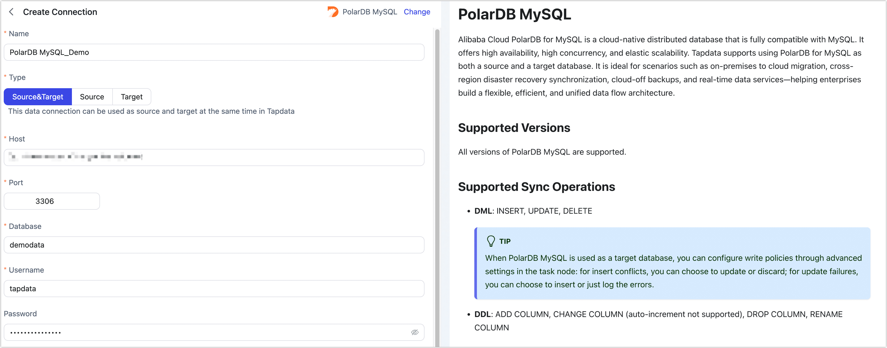

# PolarDB MySQL

import Content from '../../reuse-content/_all-features.md';

<Content />

Alibaba Cloud PolarDB for MySQL is a cloud-native distributed database that is fully compatible with MySQL. It offers high availability, high concurrency, and elastic scalability. Tapdata supports using PolarDB for MySQL as both a source and a target database. It is ideal for scenarios such as on-premises to cloud migration, cross-region disaster recovery synchronization, cloud-off backups, and real-time data services—helping enterprises build a flexible, efficient, and unified data flow architecture.

## Supported Versions

All versions of PolarDB MySQL are supported.

## Supported Sync Operations

- **DML**: INSERT, UPDATE, DELETE

  :::tip

  When PolarDB MySQL is used as a target database, you can configure write policies through advanced settings in the task node: for insert conflicts, you can choose to update or discard; for update failures, you can choose to insert or just log the errors.

  :::

- **DDL**: ADD COLUMN, CHANGE COLUMN (auto-increment not supported), DROP COLUMN, RENAME COLUMN

## Prerequisites

1. Log in to the Alibaba Cloud console and [create a database account](https://www.alibabacloud.com/help/en/polardb/polardb-for-mysql/user-guide/create-and-manage-database-accounts) for data synchronization.

   :::tip

   - To ensure sufficient privileges for synchronization, select High-Privilege Account when creating the user.
   - For fine-grained permission control, grant the source database **read access to the sync tables**, and grant the target database **read/write access**. For detailed syntax, see [Account Permission](https://www.alibabacloud.com/help/en/polardb/polardb-for-mysql/user-guide/account-permissions).

   :::

2. Enable public access if needed. If your Tapdata service is deployed in the same VPC as the PolarDB for MySQL cluster, this step can be skipped.

   1. In the left navigation, go to **Database Connections**.
   2. Click **Enable Public Address**.
   3. In the dialog, add the public IP address of the Tapdata service to the whitelist.
   4. Click **OK**.

3. If you need to connect via the public network, [apply for a public endpoint](https://www.alibabacloud.com/help/en/polardb/polardb-for-mysql/user-guide/apply-for-a-cluster-endpoint-or-a-primary-endpoint#35097e34565yw).

4. *(Optional)* To enable incremental data reading from PolarDB for MySQL, [enable Binary Logging](https://www.alibabacloud.com/help/en/polardb/polardb-for-mysql/user-guide/enable-binary-logging) (Binlog).

   :::tip

   It is recommended to set the [Binlog retention period](https://www.alibabacloud.com/help/en/polardb/polardb-for-mysql/user-guide/enable-binary-logging#7962e330893uy) to at least **7 days**. This helps prevent loss of incremental change data and ensures that incremental sync can proceed normally.

   :::

## Connect to PolarDB MySQL

1. [Log in to Tapdata Platform](../../user-guide/log-in.md).

2. In the left navigation menu, click **Connections**.

3. Click **Create** on the right side of the page.

4. In the dialog box, search for and select **PolarDB MySQL**.

5. On the connection setup page, fill in the connection details as described below:

   

   - **Connection Settings**
     - **Name**: Enter a unique name with business significance.
     - **Type**: Support using PolarDB MySQL as either a source or target database.
     - **Host**: The **primary address** of your PolarDB MySQL cluster (either internal or public).
     - **Port**: Default is **3306**.
     - **Database**: Name of the database to connect to. One connection maps to one database. For multiple databases, create separate connections.
     - **Username**: A high-privilege user account.
     - **Password**: Password for the above account.
     - **Connection Parameters**: Optional; leave blank unless needed.
     - **Time Zone**: Default is the database time zone; can be manually set if needed.
   - **Advanced Settings**
     - **CDC Log Caching**: [Mining the source database's](../../user-guide/advanced-settings/share-mining.md) incremental logs. This allows multiple tasks to share the same source database’s incremental log mining process, reducing duplicate reads and minimizing the impact of incremental synchronization on the source database. After enabling this feature, you will need to select an external storage to store the incremental log information.
     - **Contain Table**: The default option is **All**, which includes all tables. Alternatively, you can select **Custom** and manually specify the desired tables by separating their names with commas (,).
     - **Exclude Tables**: Once the switch is enabled, you have the option to specify tables to be excluded. You can do this by listing the table names separated by commas (,) in case there are multiple tables to be excluded.
     - **Agent Settings**: Defaults to **Platform automatic allocation**, you can also manually specify an agent.
     - **Model Load Time**: If there are less than 10,000 models in the data source, their schema will be updated every hour. But if the number of models exceeds 10,000, the refresh will take place daily at the time you have specified.
     - **Enable Heartbeat Table**: For source/target connections, enables automatic creation of a `_tapdata_heartbeat_table` that updates every 10 seconds (requires permissions). Used to monitor connection and task health.

6. Click **Test**. If successful, click **Save**.
