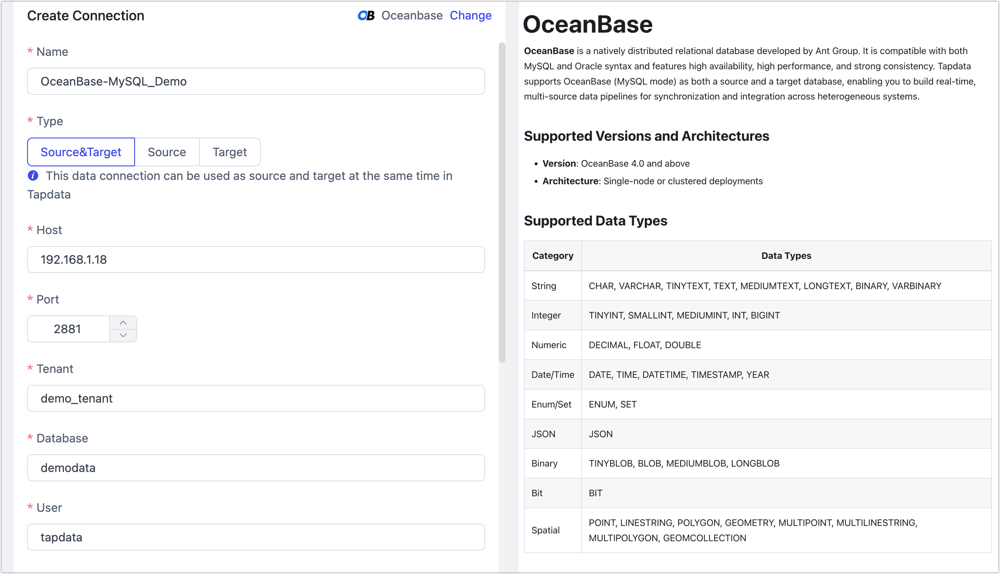

# OceanBase

import Content from '../../reuse-content/_all-features.md';

<Content />

OceanBase Database is a financial-grade distributed relational database. TapData Cloud supports using OceanBase as a target database to help you quickly build data flow links. Next, we will introduce how to connect to an OceanBase data source on the TapData Cloud.

## Supported Versions

OceanBase 3.x

import Content1 from '../../reuse-content/_alpha.md';

<Content1 />

## Preparation

1. Ensure that the network to which TapData Agent belongs has been added to the [tenant whitelist](https://en.oceanbase.com/docs/common-oceanbase-database-10000000001166968) of OceanBase.

2. Log in to the tenant as the `root` user.

3. Execute the command in the following format to create a user for data synchronization.

   ```sql
   CREATE USER 'username' IDENTIFIED BY 'password';
   ```
   
   * **username**: Username.
   * **password**: Password.
   
4. Execute the command in the following format to grant the newly created user all permissions at the database level. You can also customize more fine-grained [permission control](https://en.oceanbase.com/docs/common-oceanbase-database-10000000001169862) based on business needs.

   ```sql
   GRANT ALL ON database_name.* TO username;
   ```
   
   * **database_name**: Database name.
   * **username**: Username.

## Connect to OceanBase

1. Log in to the [TapData Cloud](https://cloud.tapdata.net/console/v3/).

2. In the left navigation panel, click **Connections**.

3. On the right side of the page, click **Create**.

4. In the pop-up dialog, search and select **OceanBase**.

5. On the redirected page, fill in the connection information for OceanBase according to the instructions below.

   

   * **Basic Connection Settings**
     * **Name**: Fill in a unique name with business significance.
     * **Type**: Currently, only supports OceanBase as a **target** database.
     * **Host**: Database connection address.
     * **Port**: The service port of OceanBase, default is **2881**.
     * **Database**: Database name, a connection corresponding to a database, if there are multiple databases, you need to create multiple connections.
     * **User**: The tenant account of the database, formatted as `username@tenant_name`, e.g., to connect to the default test tenant with the `tapdata` account, fill in as `tapdata@test`.
     * **Password**: The password corresponding to the tenant account.
     * **Connection Parameter String**: Additional connection parameters, default empty.
     * **Timezone**: By default, TapData Cloud utilizes the time zone used by the database. However, you also have the flexibility to manually specify the time zone based on your business requirements.
   * **Advanced Settings**
     * **Agent Settings**: Defaults to **Platform automatic allocation**, you can also manually specify an agent.
     * **Model Load Time**: If there are less than 10,000 models in the data source, their information will be updated every hour. But if the number of models exceeds 10,000, the refresh will take place daily at the time you have specified.

6. Click **Test**, and when passed, click **Save**.

   :::tip

   If the connection test fails, follow the prompts on the page to fix it.

   :::