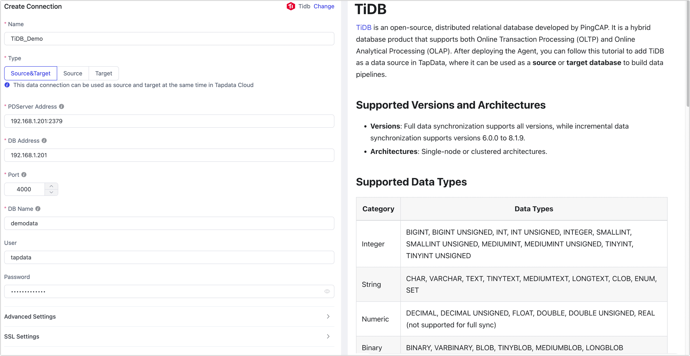

# TiDB

import Content from '../../reuse-content/_all-features.md';

<Content />

TiDB is an open-source distributed relational database designed and developed by PingCAP. It is a versatile distributed database product that supports both online transaction processing (OLTP) and online analytical processing (OLAP). Once you have completed the deployment of the Agent, you can follow this tutorial to add a TiDB data source to TapData Cloud. This will enable you to use TiDB as either a source or target database to build data pipelines.

```mdx-code-block
import Tabs from '@theme/Tabs';
import TabItem from '@theme/TabItem';
```

## Supported Versions

TiDB 5.4 and above.

## <span id="prerequisite">Prerequisites</span>

1. Log in to your TiDB database and execute the following command to create an account for data synchronization/development tasks.

   ```sql
   CREATE USER 'username'@'host' IDENTIFIED BY 'password';
   ```

   * **username**: Enter user name.
   * **host**: The host allowed for this account to log in. The percent sign (%) indicates allowing any host.
   * **password**：Enter user's password.

   Example: Create an account named 'tapdata' that allows logins from any host.

   ```sql
   CREATE USER 'tapdata'@'%' IDENTIFIED BY 'Tap@123456';
   ```

2. Grant privileges to the newly created account.

```mdx-code-block
<Tabs className="unique-tabs">
<TabItem value="As a Source Database">
```
```sql
-- Permissions required for full + incremental sync
GRANT SELECT ON *.* TO 'username' IDENTIFIED BY 'password';
```
</TabItem>

<TabItem value="As a Target Database">

```sql
-- Grant permissions to a specific database
GRANT SELECT, INSERT, UPDATE, DELETE, ALTER, CREATE, CREATE ROUTINE, CREATE TEMPORARY TABLES, DROP ON database_name.* TO 'username';

-- Grant permissions to all databases
GRANT SELECT, INSERT, UPDATE, DELETE, ALTER, CREATE, CREATE ROUTINE, CREATE TEMPORARY TABLES, DROP ON *.* TO 'username';
```
</TabItem>
</Tabs>

* **database_name**：Enter database name.
* **username**: Enter user name.
* **password**：Enter user's password.

## Connect to TiDB

1. [Log in to TapData Platform](../../user-guide/log-in.md).

2. In the left navigation panel, click **Connections**.

3. On the right side of the page, click **Create**.

4. In the pop-up dialog, search and select **TiDB**.

5. On the page that you are redirected to, follow the instructions below to fill in the connection information for TiDB.

   

   * **Connection Information**:
      * **Name**: Enter a unique name that is meaningful for your business.
      * **Type**: Support using TiDB database as either a source or target.
      * **PD Server Address**: Enter the connection address and port of the PD Server. The default port number is **2379**. This parameter is required only when used as a source database.
      * **DB Address**: Enter the database connection address.
      * **Port**: The service port of the database.
      * **DB Name**: The name of the database, where each connection corresponds to one database. If you have multiple databases, you need to create multiple data connections.
      * **Username** and **Password**: The account and password for the database. For account creation and authorization methods, refer to the [Prerequisites](#prerequisite).
   * **Advanced Settings**:
      * **Other Connection String Parameters**: Additional connection parameters, which are empty by default.
      * **Timezone for Time Types**: Default to the timezone used by the database. You can also manually specify it based on your business requirements.
      * **CDC Log Caching**: [Mining the source database's](../../user-guide/advanced-settings/share-mining.md) incremental logs, this feature allows multiple tasks to share incremental logs from the source database, avoiding redundant reads and thus significantly reducing the load on the source database during incremental synchronization. Upon enabling this feature, an external storage should be selected to store the incremental log. This parameter is required only when used as a source database.
      * **Contain Tables**: Default to **All**, and you can also customize and list the tables to include, separated by commas (,).
      * **Exclude Tables**: When enabled, you can specify tables to exclude, separated by commas (,).
      * **Agent Setting**: Default to **Platform Auto Allocation**, but you can also specify it manually.
      * **Model Load Time**: If there are less than 10,000 models in the data source, their information will be updated every hour. But if the number of models exceeds 10,000, the refresh will take place daily at the time you have specified.
      * **Enable Heartbeat Table**: This switch is supported when the connection type is set as the **Source&Target** or **Source**. TapData Cloud will generate a table named **tapdata_heartbeat_table** in the source database, which is used to monitor the source database connection and task health.
   * **SSL Settings**: Choose whether to enable SSL connections to the data source to further enhance data security. After turn on this button, you will also need to upload a CA file, client certificate, and key, as well as fill in the client password. For more information, see [Generate Self-Signed Certificates](https://docs.pingcap.com/tidb/stable/generate-self-signed-certificates).

6. Click on **Test**, and after successful testing, click **Save**.

   :::tip

   If the connection test fails, follow the on-screen instructions to troubleshoot.

   :::
