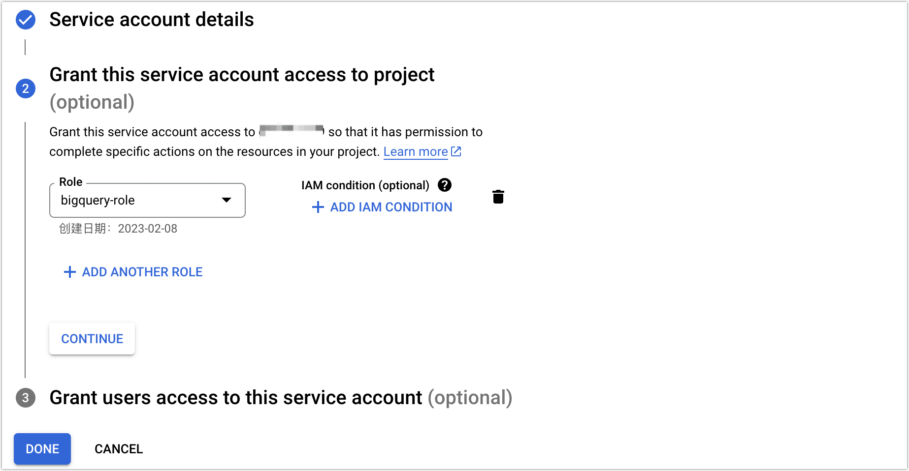
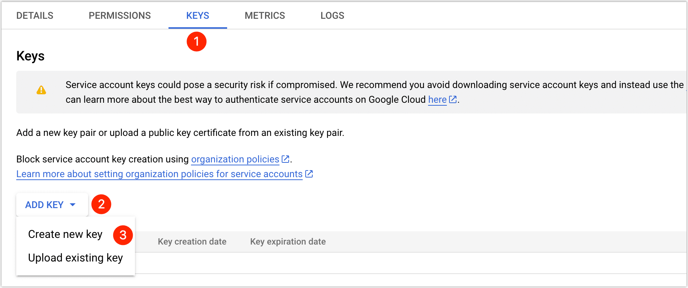
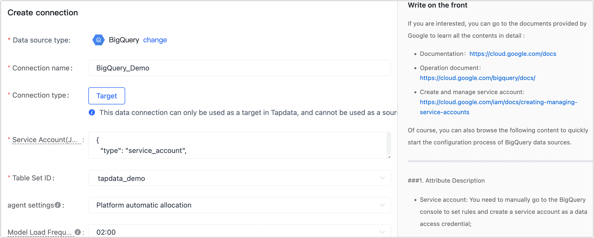

# BigQuery

Tapdata Cloud offers seamless support for data synchronization and data transformation tasks using [BigQuery](https://cloud.google.com/bigquery/docs) as the target database. BigQuery is a highly efficient, serverless, and cost-effective enterprise data warehouse that provides extensive capabilities for BI (Business Intelligence), machine learning, and AI (Artificial Intelligence). With Tapdata Cloud, you can easily integrate BigQuery data sources into your workflows. 

This article serves as a comprehensive guide, providing step-by-step instructions on adding BigQuery data sources to Tapdata Cloud, enabling efficient data synchronization and development for your projects.

## Precautions

[Agent](../../quick-start/install/install-tapdata-agent.md)'s machine can access to Google Cloud Services.

## Preparations

1. Log in to Google Cloud [Role page](https://console.cloud.google.com/iam-admin/roles) to create a role that will contain the permissions required for Tapdata Cloud to operate BigQuery.

   1. Click **CREATE ROLE**.
   2. On the redirected page, enter the role name and click **ADD PERMISSIONS**.
   3. In the pop-up dialog, search for each permission one by one and grant them accordingly.

    
Minimum Permissions List (Click to expand) 

   

       

       bigquery.datasets.create 
         bigquery.datasets.get 
         bigquery.datasets.update 
         bigquery.jobs.create 
         bigquery.jobs.get 
         bigquery.jobs.list 
         bigquery.jobs.listAll 
         bigquery.jobs.delete 
         bigquery.jobs.update 
         bigquery.routines.list 
         bigquery.routines.get 
         bigquery.tables.create 
         bigquery.tables.delete 
         bigquery.tables.get 
         bigquery.tables.getData 
         bigquery.tables.list 
         bigquery.tables.setCategory 
         bigquery.tables.update 
         bigquery.tables.updateData
       

     

   

2. After the permission selection is complete, click **CREATE**.

3. Log in to Google Cloud [Credentials page](https://console.cloud.google.com/apis/credentials) to create a service account that will be used for subsequent authentication.

   1. At the top of the page, click **CREATE CREDENTIALS** > **Service Account**.

   2. In the Service account details section, provide the name, ID, and description for the service account, and then click **CREATE AND CONTINUE**.

      

   3. In the **Role** drop-down box, select the role we just created (**bigquery-role**), and click **DONE** at the bottom of the page.

      

4. Create an authentication key for the service account.

   1. On the **Credentials** page, click the service account you just created at the bottom of the page.

   2. On the **KEYS** table, click **ADD KEY** > **Create new key**.

      

   3. In the pop-up dialog, select the **key type** as **JSON**, and click **CREATE**.

      After the operation is completed, the key file will be automatically downloaded and saved to your computer. In order to ensure the security of your account, please keep the key file safe.

   4. Log in to Google Cloud Console to create datasets and tables, skipping this step if tables already exists.

      1. [Create BigQuery Dataset](https://cloud.google.com/bigquery/docs/datasets?hl=zh-cn).

         :::tip

         To ensure that Tapdata Cloud properly reads the dataset information, when creating the dataset, select the **Location type** as **Multi-region**.

         :::

      2. [Create Tables](https://cloud.google.com/bigquery/docs/tables?hl=zh-cn).

## Connect to BigQuery

1. Log in to [Tapdata Cloud](https://cloud.tapdata.io/).

2. In the left navigation panel, click **Connections**.

3. On the right side of the page, click **Create connection**.

4. In the pop-up dialog, select **BigQuery**.

5. Fill in the connection information for BigQuery on the redirected page, following the instructions provided below.

   

   * **Connection name**: Fill in a unique name that has business significance.
   * **Connection type**: Currently only supported as a **Target**.
   * **Service Account(JSON)**: Open the key file that you have downloaded in advance using a text editor. Copy the content of the file and paste it into the text box provided.
   * **Table Set ID**: Select a dataset that already exists in BigQuery.
   * **Agent settings**: Defaults to **Platform automatic allocation**, you can also manually specify an agent.
   * **Model load time**: If there are less than 10,000 models in the data source, their information will be updated every hour. But if the number of models exceeds 10,000, the refresh will take place daily at the time you have specified.

6. Click **Connection Test**, and when passed, click **Save**.

   :::tip

   If the connection test fails, follow the prompts on the page to fix it.

   :::

## Related Topics

[MySQL to BigQuery Real-Time Sync](../../best-practice/mysql-to-bigquery)
