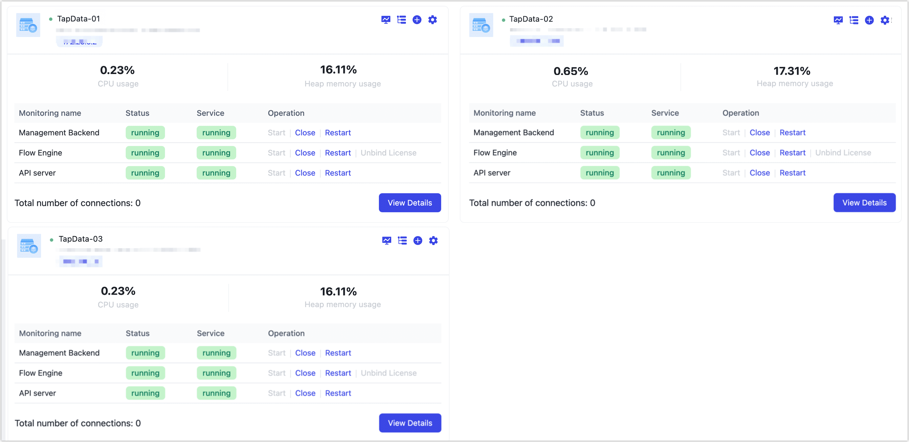

# Deploy HA TapData Enterprise (3 Nodes)

import Content from '../reuse-content/_enterprise-features.md';

<Content />

To ensure the reliability of business operations in a production environment, a high availability (HA) deployment is recommended. This guide explains how to deploy TapData services using three servers to achieve high availability.

## Deployment Architecture

In this example, we have three servers (as illustrated in the architecture below), each configured with an IP address or hostname. We will deploy **MongoDB services** (to store information required for TapData operations) and complete **TapData services** (including management services, data synchronization governance services, and API services) on each of these servers to achieve overall service high availability.


In this example, each server is equipped with a **16-core CPU and 32 GB of RAM**. The recommended minimum hardware configuration is an **8-core CPU with 16 GB of RAM**, and the operating system should be CentOS 7+ or Ubuntu 16.04+.

| Service                 | Service Port | Role Description                                             | Resource Planning Recommendations                            |
| ----------------------- | ------------ | ------------------------------------------------------------ | ------------------------------------------------------------ |
| Management Service      | 3030         | Responsible for providing task management services; does not require continuous memory usage while tasks are running, so it has low load requirements | Recommended to use 18% of total memory: `32*0.18` = `5.76` rounded up to 6 GB |
| Sync Governance Service | N/A          | Responsible for executing data sync/transform tasks and associated processing nodes, requiring substantial computational and memory resources | Recommended to use 35% of total memory: `32*0.35` = `11.2` rounded up to 12 GB |
| API Service             | 3080         | Responsible for publishing table data as APIs and providing call and management services. System resources are automatically allocated, with each process using approximately 100 MB of memory | The default number of Worker processes equals the number of CPU cores; it is recommended to adjust based on API service load |
| MongoDB Service         | 27017        | Responsible for storing essential configurations, shared caches, and other information generated during TapData operations | Recommended to use 30% of total memory: `32*0.3` = `9.6` rounded up to 10 GB |

## Preparation

Before deployment, perform the following steps on each of the three servers. This guide uses CentOS 7 as an example to demonstrate the deployment process.

1. Log in to the server and run the following commands to configure system parameters such as file access numbers and the firewall.

   ```bash
   ulimit -n 1024000 
   echo "* soft nofile 1024000" >> /etc/security/limits.conf 
   echo "* hard nofile 1024000" >> /etc/security/limits.conf 
   systemctl disable firewalld.service 
   systemctl stop firewalld.service 
   setenforce 0 
   sed -i "s/enforcing/disabled/g" /etc/selinux/config 
   ```

2. Run the following command to install Java 1.8.

   ```bash
   yum -y install java-1.8.0-openjdk
   ```

3. Ensure consistent machine time and time zone settings across all servers.

4. [Deploy a MongoDB Replica Set](../production-admin/install-replica-mongodb.md) to store necessary configurations and shared cache generated by the Tapdata services.

   :::tip
   Adjust MongoDB's resource configuration based on the server specifications. In this example, the `cacheSizeGB` is set to `10`, and `oplogSizeMB` is set to `51200`. For more configuration details, refer to [MongoDB Configuration File Options](https://www.mongodb.com/docs/v4.4/reference/configuration-options).
   :::

## Install Services

:::tip
The following operations need to be **performed separately on each of the three servers** to complete the deployment process.
:::

1. Obtain the License file.

   1. Run the following command to get the SID information required for the license application.

      ```bash
      java -cp components/tm.jar -Dloader.main=com.tapdata.tm.license.util.SidGenerator org.springframework.boot.loader.PropertiesLauncher
      ```

   2. Provide the printed SID information to the TapData support team to complete the license application process.

   3. Upload the acquired License file to the extracted directory (named **tapdata**).

2. Download the TapData installation package (contact [Tapdata](mailto:team@tapdata.io) for access) and upload it to the target deployment device.

3. On all target devices, run the following commands to create the installation and working directories, and extract the TapData installation package into the directory.

   ```bash
   # Create installation and working directories
   mkdir -p /data/tapdata/tapdata_work
   # Extract the installation package (replace the package name with the actual name)
   tar -zxvf installation-package-name -C /data/tapdata
   ```

4. Navigate to the extracted directory and run the `./tapdata start` command to start the TapData deployment process. Follow the command line prompts to set up TapData's login address, API service port, MongoDB connection authentication, and other settings. An example setup is provided below:

   :::tip
   If deploying as a non-root user, avoid using `sudo` to prevent installation failures. Before running commands, grant full permissions to the current user for the installation directory using `sudo chown -R <your-username>:<your-group> <installation-dir>` or `sudo chmod -R 777 <installation-dir>`.
   :::

   ```bash
   ./tapdata start
    _______       _____  _____       _______
   |__   __|/\   |  __ \|  __ \   /\|__   __|/\    
      | |  /  \  | |__) | |  | | /  \  | |  /  \   
      | | / /\ \ |  ___/| |  | |/ /\ \ | | / /\ \  
      | |/ ____ \| |    | |__| / ____ \| |/ ____ \ 
      |_/_/    \_\_|    |_____/_/    \_\_/_/    \_\ 
   
   WORK DIR:/root/tapdata
   Init tapdata...
   # Set TapData management interface address list
   ✔ Please enter backend url, comma separated list. e.g.:http://127.0.0.1:3030/ (Default: http://127.0.0.1:3030/):  … http://192.168.1.201:3030,http://192.168.1.202:3030,http://192.168.1.203:3030
   # Set TapData service port (default is fine)
   ✔ Please enter tapdata port. (Default: 3030):  … 
   ✔ Please enter api server port. (Default: 3080):  … 
   # MongoDB authentication
   ✔ Does MongoDB require username/password?(y/n):  … y
   # Enter MongoDB username, password, and authentication database if applicable (default is admin)
   ✔ Does MongoDB require TLS/SSL?(y/n):  … no
   # Set MongoDB connection string
   ✔ Please enter mongodb connection string without username and password (Default: mongodb://127.0.0.1:27017/tapdata)
   mongodb://192.168.1.201:27017,192.168.1.202:27017,192.168.1.203:27017/tapdata
   ✔ Does API Server response error code?(y/n):  … yes
   System initialized. To start Tapdata, run: tapdata start
   WORK DIR:/data/tapdata/tapdata_work
   Testing JDK...
   java version:1.8
   Java environment OK.
   Unpack the files...
   frontend server started.begin deploy init
   Try to connect to TM for deploy connector...
   deploy connector...
   ```

   * **Please enter backend url**: Enter the TapData platform login address. In this example, set the login addresses for servers A, B, and C, separated by commas: `http://192.168.1.201:3030,http://192.168.1.202:3030,http://192.168.1.203:3030`
   * **Please enter tapdata port**: Enter the TapData platform login port, default is `3030`.
   * **Please enter api server port**: Enter the API server port, default is `3080`.
   * **Does MongoDB require username/password?**: Specify if MongoDB uses authentication. Enter **n** if not, or **y** if yes, and provide the MongoDB username, password, and authentication database (default is `admin`).
   * **Does MongoDB require TLS/SSL?(y/n)**: Specify if MongoDB uses TLS/SSL encryption. Enter **n** if not, or **y** if yes, and provide paths to the CA certificate and Certificate Key files, along with the password for the Certificate Key.
   * **Please enter MongoDB host, port, database name**: Enter the MongoDB URI connection information. In this example, enter: `mongodb://192.168.1.201:27017,192.168.1.202:27017,192.168.1.203:27017/tapdata`.
   * **Does API Server response error code?**: Specify if the API server should respond with error codes.

   Upon successful deployment, the command line will display output similar to the following:

   ```bash
   deployed connector.
   Waiting for the flow engine to start \
   FlowEngine is startup at : 2023-04-01 23:10
   API service started
   ```

5. Adjust TapData memory resource settings. In this example, each server has 32 GB of memory, and MongoDB is allocated 8 GB, leaving 24 GB of available memory. The settings and descriptions are as follows:

      - `tapdataTMJavaOpts`: Controls the memory usage limit for the **Management Service**, typically set to around 18% of total memory. In this example, set it to `"-Xms4G -Xmx6G"`.
      - `tapdataJavaOpts`: Controls the memory usage limit for the **Sync Governance Service**, typically set to 35% of total memory. In this example, set it to `"-Xms12G -Xmx12G"`.
      - `apiWorkerCount`: Controls the number of workers in the API service. The default is the number of CPU cores. It can be adjusted based on the API service load; in this example, it is set to `4`.

6. Set TapData services to start automatically on boot.

   1. Navigate to the `/usr/lib/systemd/system` directory, create a new service file using a text editor (e.g., `vim`), and name it `tapdata.service`. Paste the following content into the file.

      ```bash
      [Unit]
      Description=Tapdata Service
      After=network.target
      
      [Service]
      Type=simple
      User=root
      # Set the paths according to the tapdata installation path
      ExecStart=/data/tapdata/tapdata start
      ExecStop=/data/tapdata/tapdata stop
      Restart=on-failure
      
      [Install]
      WantedBy=multi-user.target
      ```

   2. Load the new service file and enable it to start automatically on boot:

      ```bash
      sudo systemctl daemon-reload
      sudo systemctl enable tapdata.service
      ```

   3. (Optional) During low business activity periods, reboot the machine and check if the TapData service starts correctly using `systemctl status tapdata.service`.

## Log in to TapData

After completing the above deployment steps on all three servers, you can log in to the management interface using http://192.168.1.201:3030, http://192.168.1.202:3030, or http://192.168.1.203:3030 from any device on the same intranet. If local DNS is configured, you can log in using the corresponding server hostname.

:::tip
For security, change your password upon first login.
:::

Upon successful login, you can view the status of the TapData services on all three servers under **System Management** > **Cluster Management**.



## Next Steps

[Connect to a Database](../quick-start/connect-database.md)