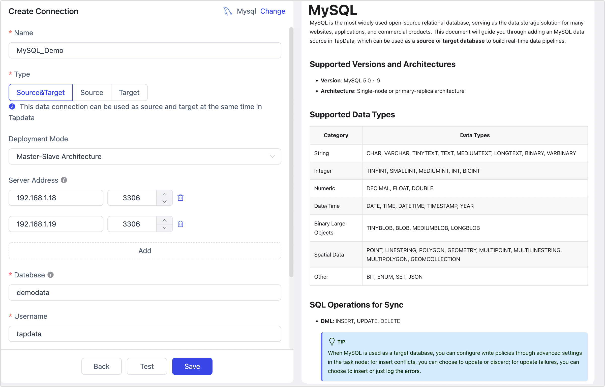

# Step 2: Connect Data Sources

Once you have [installed the Agent](install), you need to connect the Agent to the data sources through Tapdata, and you can create a data pipeline once the connection has been established.

:::tip

Before connecting to the data sources, you also need to ensure that the network environment is accessed properly and complete the authorization of the database account. For more information, see [Preparation](../prerequisites/README.md).

:::

## Procedure

1. Log in to [Tapdata Platform](https://cloud.tapdata.io/).

2. In the left navigation panel, click **Connections**.

3. On the right side of the page, click on **Create**. A dialog box will appear, where you can select the desired data source to establish a connection with.

   

4. After being redirected to the connection configuration page, proceed to fill in the required data source connection information. 

   On the right panel of the page, you will find helpful information and guidance regarding the configuration of the connection.

   :::tip

   The operation process will be demonstrated using MySQL as an example. For more examples, see [Connect Data Sources](../prerequisites/README.md).

   :::

   

   * **Connection name**: Enter a unique name that holds business significance.
   * **Connection type**: Select Source, Target, or Source&Target.
   * **Host**: The database connection address.
   * **Port**: The service port of database.
   * **Database**: database name, a connection corresponding to a database, if there are multiple databases, you need to create multiple connections.
   * **username**: Enter database server username.
   * **Password**: The database password.
   * **Connection Parameter String**: Additional connection parameters, default empty.
   * **timezone**: Defaults to the time zone used by the database, which you can also manually specify according to your business needs.
   * **Contain table**: The default option is **All**, but you also have the choice to select **Custom** and specify the included tables. If there are multiple tables, separate them by commas (,) when filling in the table names.
   * **Exclude tables**: Once you have enabled the switch, you can configure the tables to be excluded by specifying their names, separated by commas (,) if there are multiple tables.
   * **Agent settings**: Defaults to **Platform automatic allocation**, you can also manually specify an agent.

5. Click **Connection Test** at the bottom of the page, and when passed the check, click **Save**.

   :::tip

   If the connection test fails, follow the prompts on the page to fix it.

   :::

## Next step

[Create a Data Pipeline](create-task)