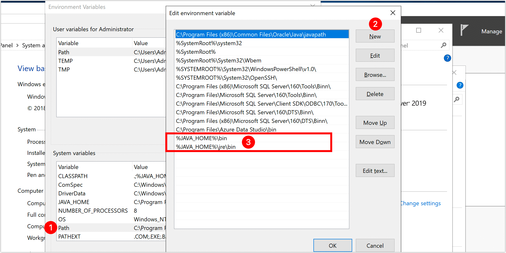

# Stand-alone Deployment (Windows)

This guide explains how to quickly deploy Tapdata services on a Windows platform.

:::tip

Stand-alone deployment is suitable for functional testing scenarios. For production environments, it is recommended to use [high-availability deployment](../../../production-admin/install-tapdata-ha.md).

:::

## Hardware & Software Requirements

- CPU: 8 cores
- Memory: 16 GB
- Storage Space: 100 GB
- Operating System: Windows OS (64-bit)

## Preparation

1. Install MongoDB (version 4.0 and above), which will serve as the storage system for Tapdata to run related data, such as logs and metadata. For more information, see [Deploy MongoDB Replica Set](../../../production-admin/install-replica-mongodb.md).

2. Log in to the target device, install Java 1.8 and set environment variables.

   1. [Download Java 1.8](https://www.oracle.com/java/technologies/javase/javase8-archive-downloads.html) and follow the prompts to complete the installation.

   2. Go to **Control Panel** > **System and Security** > **System**.

   3. Click **Advanced System Settings** on the left, then click **Environment Variables**.

      

   4. In the dialog that appears, click **New** under **System Variables**, fill in the variable name and value, and click **OK**.

      

      - **Variable Name**: `JAVA_HOME`
      - **Variable Value**: The installation path of JDK, for example, `C:\Program Files\Java\jdk1.8.0_202`

   5. In the **System Variables** area, find and double-click the **Path** variable, then in the dialog that appears, add the following environment variables, and click **OK**.

      

      - `%JAVA_HOME%\bin`
      - `%JAVA_HOME%\jre\bin`

   6. Following step 4, continue to add a system variable with the name and value as follows, then click **OK** after completing the setup.

      - **Variable Name**: `CLASSPATH`
      - **Variable Value**: `.;%JAVA_HOME%\lib;%JAVA_HOME%\lib\dt.jar;%JAVA_HOME%\lib\tools.jar`

   7. (Optional) Open the command line, execute `java -version` to verify the effectiveness of the environment variable. Successful execution example:

      ```bash
      java version "1.8.0_202"
      Java(TM) SE Runtime Environment (build 1.8.0_202-b08)
      Java HotSpot(TM) 64-Bit Server VM (build 25.202-b08, mixed mode)
      ```


## Procedure

:::tip

This example uses Windows Server 2019 to demonstrate the deployment process.

:::

1. Download the Tapdata installation package (you can [contact us](mailto:team@tapdata.io) to obtain it) and unzip the package to the desired directory.

2. Open the command line, navigate to the unzipped directory by executing the following command, in this example, `D:\tapdata`.

   ```bash
   cd /d D:\tapdata
   ```

3. Prepare the License file.

   1. Execute the following command to obtain the SID information required for the application.

      ```bash
      java -cp components/tm.jar -Dloader.main=com.tapdata.tm.license.util.SidGenerator org.springframework.boot.loader.PropertiesLauncher
      ```

   2. Provide the printed SID information to the Tapdata support team to complete the License application process.

   3. Upload the obtained License file to the unzipped directory.

2. Execute `./tapdata.exe start` and follow the command line prompts to set Tapdata's login address, API service port, MongoDB connection information, etc. Example and explanations are as follows:

   ```bash
    ./tapdata.exe start
    _______       _____  _____       _______
   |__   __|/\   |  __ \|  __ \   /\|__   __|/\    
      | |  /  \  | |__) | |  | | /  \  | |  /  \   
      | | / /\ \ |  ___/| |  |/ /\ \ | | / /\ \  
      | |/ ____ \| |    | |__| / ____ \| |/ ____ \ 
      |_/_/    \_\_|    |_____/_/    \_\_/_/    \_\
   
   WORK DIR:/root/tapdata
   Init tapdata...
   ✔ Please enter backend url, comma-separated list. e.g.:http://127.0.0.1:3030/ (Default: http://127.0.0.1:3030/):  …
   ✔ Please enter tapdata port. (Default: 3030):  …
   ✔ Please enter API server port. (Default: 3080):  …
   ✔ Does MongoDB require username/password?(y/n):  … no
   ✔ Does MongoDB require TLS/SSL?(y/n):  … no
   ✔ Please enter MongoDB host, port, database name(Default: 127.0.0.1:27017/tapdata):  …
   ✔ Does API Server response error code?(y/n):  … yes
   MongoDB URI:  mongodb://127.0.0.1:27017/tapdata
   MongoDB connection command: mongo  mongodb://127.0.0.1:27017/tapdata
   System initialized. To start Tapdata, run: tapdata start
   WORK DIR:/root/tapdata
   Testing JDK...
   Java version:1.8
   Java environment OK.
   Unpack the files...
   Restart TapdataAgent ...:
   TapdataAgent starting ...:
   ```

   * **Please enter backend url**: Set the login address for the Tapdata platform, default is `http://127.0.0.1:3030/`.
   * **Please enter tapdata port**: Set the login port for the Tapdata platform, default is `3030`.
   * **Please enter API server port**: Set the service port for the API Server, default is `3080`.
   * **Does MongoDB require username/password?**: If MongoDB database has enabled security authentication, enter **y** then follow prompts to enter username, password, and the authentication database (default is `admin`).
   * **Does MongoDB require TLS/SSL?(y/n)**: If MongoDB database has enabled TSL/SSL encryption, enter **y** then follow prompts to enter the absolute path of the CA certificate and Certificate Key file, and the file password of the Certificate Key.
   * **Please enter MongoDB host, port, database name**: Set the URI connection information for the MongoDB database, default is `127.0.0.1:27017/tapdata`.
   * **Does API Server response error code?**: Whether to enable API Server response error code function.

   After successful deployment, the command line returns the following example:

   ```bash
   deployed connector.
   Waiting for the flow engine to start \
   FlowEngine is startup at : 2023-04-01 23:00
   API service started
   ```

3. Log in to the Tapdata platform through a browser. The local login address is [http://127.0.0.1:3030](http://127.0.0.1:3030). Please change the password promptly after the first login to ensure security.

   :::tip

   To access the Tapdata service from other devices on the same internal network, ensure the network is intercommunicable, for example, [setting Windows Firewall](https://learn.microsoft.com/en-us/windows/security/threat-protection/windows-firewall/configure-the-windows-firewall-to-allow-sql-server-access) to allow access to ports 3030 and 3080 on the local machine.

   :::

## Deployment Example

import AsciinemaPlayer from '@site/src/components/AsciinemaPlayer/AsciinemaPlayer.tsx';

<AsciinemaWidget src="https://docs.tapdata.io/asciinema_playbook/install_tapdata.cast" rows={20} idleTimeLimit={3} preload={true} />

<AsciinemaPlayer
src="/asciinema_playbook/install_tapdata.cast"
poster="npt:0:20"
rows={25}
speed={1.8}
preload={true}
terminalFontSize="15px"
fit={false}
/>

## Next Steps

[Connect to Databases](../../connect-database.md)