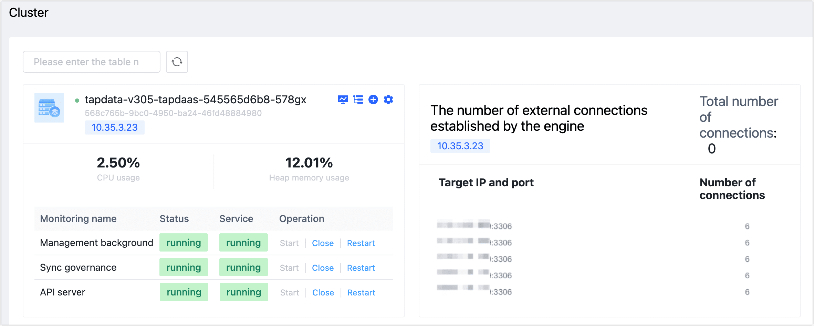

# Manage Clusters

Through the Cluster Management page, you can view the running status of all components within the current cluster, the number of external connections established, and other information. It also supports management operations.

## Procedure

1. Log in to TapData Platform as a system administrator.

2. In the left navigation bar, select **System** > **Cluster**. The default view is **Cluster View**, where you can see the operational status and connection information of each component.

   You can also start/stop, and restart services. Note that stopping and restarting operations will affect the normal operation of related services, so please operate during maintenance windows or during business off-peak periods.

   

3. On this page, choose the following operations according to business needs.

    * Click  to download the thread resource usage details of the current engine, in JSON format.

    * Click  to download the data source usage details of the current engine, in JSON format.

    * Click  to adjust the server name and switch the network card display information.

      :::tip

      Switching the network card display information only changes the IP address display under the server on the Cluster Management page and will not affect functional operation.

      :::

    * Click  to add custom service monitoring.

4. Click **Component View** in the upper right corner, and the page will display the status information of components by category. Additionally, you can assign different tags to multiple synchronization governance services (Agents). These tags can then be specified when configuring data synchronization or transformation tasks.

    
    
5. If you have deployed the [Raw Log Parsing Service](../case-practices/best-practice/raw-logs-solution.md), you can click **Log Mining Monitor** to view the resource usage (such as CPU, memory, etc.) of the server where the service is running. This helps you gain a comprehensive understanding of the service’s operational status.