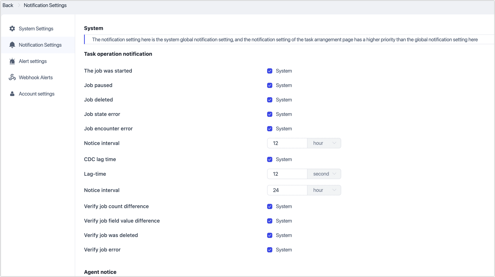
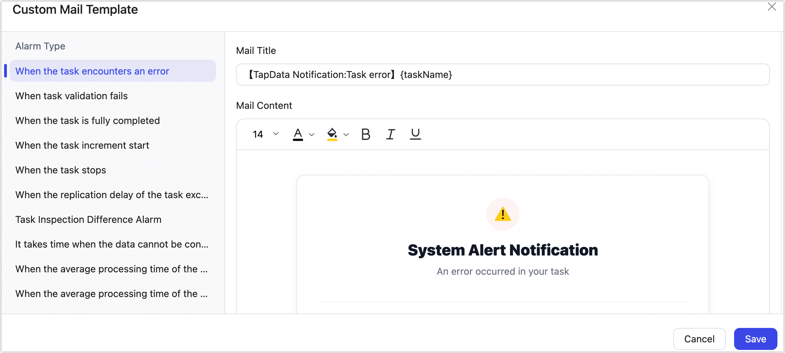

# Notification and Alert Settings

import Content from '../../reuse-content/_enterprise-features.md';

<Content />

:::tip

If you are using TapData Cloud, notification messages and configuration entry points are located at the top right of the page. You can set notification rules and alert recipients.

:::

TapData supports custom system and alert settings and integrates with third-party platforms via Webhook, helping you quickly grasp the status of task operations.

## Notification Settings

After [logging into the TapData platform](../../user-guide/log-in.md), click the  > **Notification Settings** at the top right corner. You can set up custom notification rules to automatically trigger notification processes. The main types are task operation notifications and Agent notifications. The specific notification items include:

**System Notice Settings**

- The job was startedSystem
- Job pausedSystem
- Job deletedSystem
- Job state errorSystem
- Job encounter error
- CDC lag time
- Verify job count differenceSystem
- Verify job field value differenceSystem
- Verify job was deletedSystem
- Verify job errorSystem

**Agent Notice Settings**

- Server disconnectedSystem
- Agent startedSystem
- Agent stoppedSystem
- Agent createdSystem
- Agent deleted

## Alert Settings

In the **Alert Settings**, you can configure which task events should trigger alert notifications, how the notifications are sent (e.g., via email), and the notification interval.

:::tip

For a practical example of email alert setup, see [Send Alerts via Mail](../../case-practices/best-practice/alert-via-qqmail.md).

:::

You can also click **Custom Email Template** in the top-right corner of the page to personalize the email subject and body content, allowing better alignment with your business needs.

The subject and body support the following insertable variables: `{taskName}` (task name), `{errorTime}` (error time), and `{errorLog}` (error log). You can quickly insert them by clicking the variable names at the bottom of the page.

## Webhook Alerts

With the Webhook alert feature, you can quickly integrate with your alert platform or third-party platform by simply providing the service URL. This allows for more notification methods, such as instant messaging platforms.

