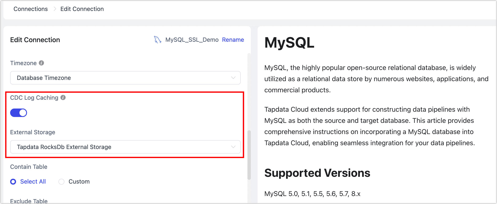

# Manage External Storage

import Content from '../../reuse-content/_enterprise-and-community-features.md';

<Content />

To facilitate the quick reading of task-related information subsequently, TapData stores necessary configurations, incremental logs of source tables, and other information related to the task in its internal MongoDB database. To store more data, you can create an external database to store relevant data.

## Prerequisites

An external database intended for data storage has been created. Currently, MongoDB and RocksDB are supported.

## Create External Storage

1. [Log in to TapData Platform](../log-in.md).

2. In the left navigation bar, select **Advanced** > **External Storage**.

3. On the right side of the page, click **Create External Storage**.

4. In the pop-up dialog, complete the configuration according to the instructions below.

   

   * **Storage Name**: Enter a cache name with business significance for easy identification later.
   * **External Memory Type**: Supports **MongoDB** and **RocksDB**.
   * **Storage Path**: Enter the database connection address, for example, for MongoDB refer to: `mongodb:/admin:password@127.0.0.1:27017/mydb?replicaSet=xxx&authSource=admin`.
   * **Connect Using TLS/SSL**: Choose whether to enable TSL/SSL encryption; if this function is enabled, you will also need to upload the client’s private key.
   * **Set as Default**: Choose whether to use it as the default external storage.

5. Click **Test**; after passing the test, click **Save**.

   :::tip

   If the connection test fails as indicated, please fix it according to the page prompt.

   :::

## Use External Storage

You can enable the Shared Mining feature and select the recently configured external storage when [creating a connection](../../prerequisites/README.md), as shown in the example below: 

