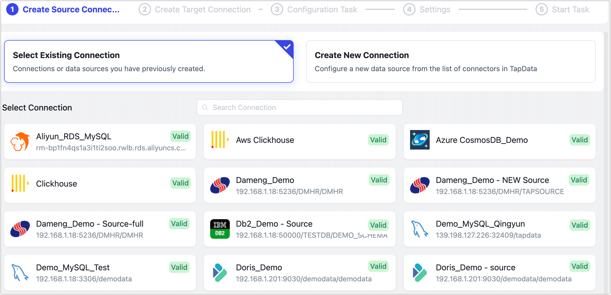
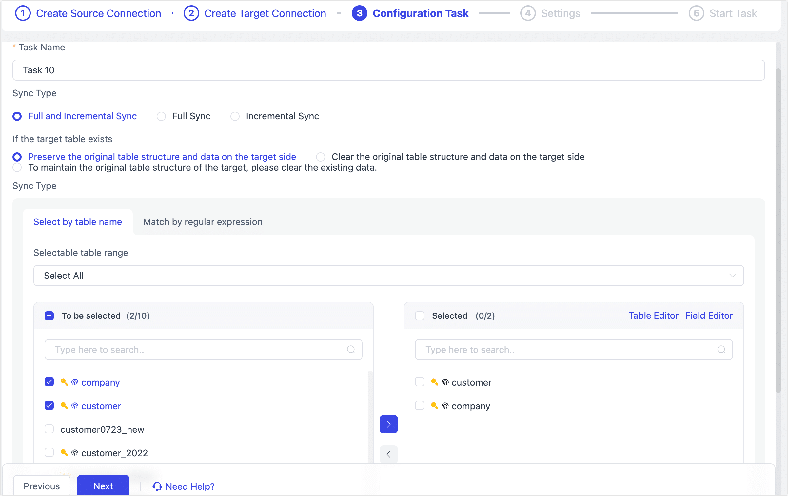
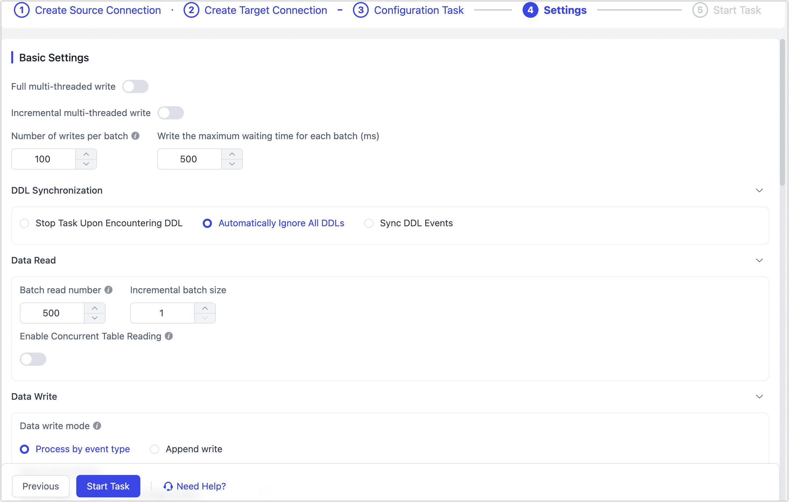
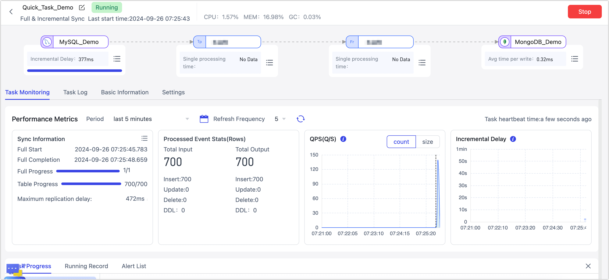

# Quickly Create Data Replication Task

import Content from '../../reuse-content/_cloud-features.md';

<Content />

The data replication feature helps you achieve real-time synchronization between homogeneous or heterogeneous data sources. It is suitable for various business scenarios such as data migration/synchronization, disaster recovery, and read performance expansion. TapData supports a form-based wizard to guide you through creating replication tasks quickly. This article explains the detailed process.

## Steps

  
Best Practices

  To build efficient and reliable data replication tasks, it is recommended to read <a href="../../../case-practices/best-practice/data-sync">Data Synchronization Best Practices</a> before starting to configure tasks.

1. [Log in to TapData platform](../log-in.md).

2. In the left navigation bar, click **Data Replication**.

3. Click **Quickly Create Task** on the right side of the page to go to the task creation form.

4. First, select the data source as the source database. You can choose to **Create New Connection** or **Select Existing Connection**.

   

   :::tip

   The following steps demonstrate how to synchronize MySQL to MongoDB in real-time using the **Select Existing Connection** option. The process is similar for other data sources. For information on how to create data sources in advance, see [Connecting Data Sources](../../connectors/README.md).

   :::

5. Select **Existing Connection** and choose MySQL as the source database, then click **Next**.

6. Select **Existing Connection** and choose MongoDB as the target database, then click **Next**.

7. In the **Configure Task** step, configure the task details according to the instructions below.

   

   * **Task Name**: Enter a meaningful name.
   * **Sync Type**: The default is **Full and Incremental Sync**, but you can also choose **Full Sync** or **Incremental Sync** separately.
     - **Full Sync**: Copies the existing data from the source to the target.
     - **Incremental Sync**: Copies new data or data changes in real-time from the source to the target.
     - The combination of both can be used for real-time data synchronization scenarios.
   * **Duplicate Handling Policy**: Choose based on your business needs. The default is to **Preserve the Original Table Structure and Data on the Target Side**.
   * **Select Tables**: Choose based on your business needs.
     - **Select by Table Name**: Select the tables in the area to be replicated, then click the right arrow to complete the setup.
     - **Select by Regular Expression**: Enter the table name's regular expression. Additionally, if a new table in the source database matches the expression, it will be automatically synchronized to the target database.
   * **Selectable table range**: By default, all tables are displayed, but you can choose to filter only tables with primary keys or only tables without primary keys. Since tables without primary keys use the full primary key method to implement data updates, they might encounter errors due to exceeding the index length limit, and their performance might be limited. Therefore, it is recommended that you create separate data replication tasks for tables without primary keys to avoid task errors and enhance the performance of data updates.

8. Click **Next** to configure more task settings.

   

   * **Basic Settings**
     - **Full Multi-thread Writing**: The number of concurrent threads for writing full data. It is disabled by default.
     - **Multi-threaded Incremental Write**: The number of concurrent threads for incremental data writing. It is disabled by default. You can enable and adjust based on the write performance of the target database.
     - **Number of Writes Per Batch**: The number of entries per batch during full synchronization.
     - **Write The Maximum Waiting Time for Each Batch**: Set the maximum wait time based on the target database performance and network latency. The unit is milliseconds.
     - **DDL Synchronization Settings**: Select the DDL event handling strategy. The default is **Automatically Ignore All DDL**. You can choose **Sync DDL Events** and select the DDL events to capture, typically including **Add Column**, **Change Column Name**, **Modify Column Attribute**, **Drop Column**. For more information, see [Handling Schema Changes](../../case-practices/best-practice/handle-schema-changes.md).
     - **Data Read Settings**: Choose the number of entries to read per batch in the full and incremental stages. The default values are 500 and 1, respectively. You can also choose to enable **Enable Concurrent Table Reading** (suitable for scenarios with many small tables).
     - **Data Write Settings**: Choose the data write strategy:
       - **Process by by Event Type**: After selecting this option, you need to choose the data write strategy for insert, update, and delete events.
       - **Append Write**: Only handles insert events, discards update and delete events.
   * **Advanced Settings**
     - **When the Event Processing is Abnormal**: The default is to retry, but you can choose to skip the erroneous event and continue the task.
     - **Other Settings**: Set the task start time, shared mining, periodic scheduling, dynamic memory adjustment, incremental data processing mode, processor threads, Agent, etc.
   * **Alert Settings**: By default, if the average processing time of the node is greater than or equal to 5 seconds for 1 minute, a system and email notification will be sent. You can adjust the rules or disable alerts based on your business needs.

9. After configuration, click **Start Task**.

10. After the task starts successfully, it will automatically jump to the task monitoring page, where you can view information such as RPS (records per second), latency, and task events.

    Additionally, to ensure the normal operation of the task, TapData will perform a pre-check based on node configuration and data source characteristics. You can view the printed log information at the bottom of the page.

    

## See also

* [Processing Nodes](process-node.md): Combine multiple processing nodes and data sources to achieve more complex and customized data flow capabilities.
* [FAQ](../../faq/data-pipeline.md): Common issues and solutions when using the data replication feature.
