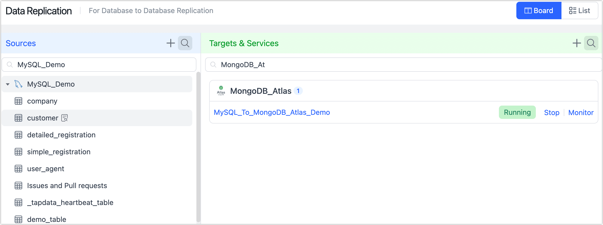

# Generate Data Pipeline with One Click

import Content from '../../../reuse-content/_all-features.md';

<Content />

In the **Board** view mode, you can simply drag the source table to the target database to generate a data pipeline with one click, greatly simplifying the task configuration process and real-time synchronization of source data. This article introduce how to generate a data pipeline.

## Procedure

1. [Log in to Tapdata Platform](../../log-in.md).

2. Based on the product type, select the operation entry:

    * **Tapdata Cloud**: In the left navigation panel, click **Data Replications**.
    * **Tapdata Enterprise or Tapdata Community**: In the left navigation panel, choose **Data Pipelines** > **Replications**.
3. In the upper right corner of the page, click on **Board** to switch to the Data Board view.

4. On this page, you can conveniently view the data source information you have entered. The page is divided into two columns labeled **Sources** and **Targets & Services** by Tapdata. This helps you distinguish between the source and target data sources and provides a clear overview of your data connections.

   

5. (Optional) Click the 🔍 icon to find the source table you want to synchronize and drag it to the right target data source.

6. In the pop-up dialog box, fill in a task name that is meaningful for your business, select the synchronization type, and choose whether to run the task.

   

   - **Only Save**: Save the task without running it. You can now click on the task name in the target data card to customize the task further. On the redirected task configuration page, you can add [processing nodes](../data-development/process-node) to meet requirements such as table structure adjustment (e.g., adding fields), table merging, and building wide tables. Once the setup is complete, click **Start** in the upper right corner of the page.

   - **Save and Run**: No additional action is required. Tapdata will automatically create a data transformation task and run it to synchronize your source tables in real-time to the selected target data source. In this case, the **customer** table in the source MySQL will be synchronized to MongoDB in real-time.

      You can also click the task name in the target data card to enter the task monitoring page to see the detailed operation status. For more information, see [Monitoring Tasks](monitor-task.md).

