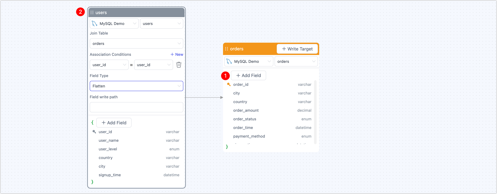
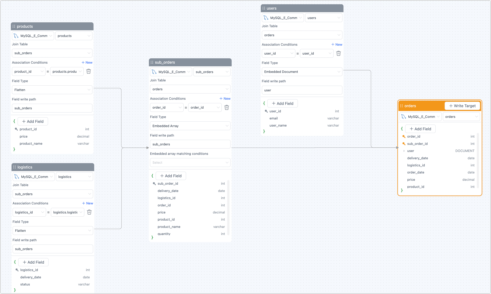
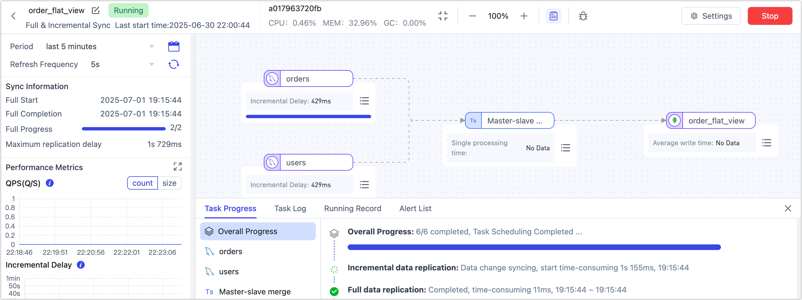

# Build Real-Time Materialized Views (Beta)

import Content from '../../../reuse-content/_all-features.md';

<Content />

Materialized views are specialized database object that cache the results of intricate queries, thereby accelerating data retrieval. With Tapdata, you can craft real-time materialized views across diverse data sources. This not only ensures accuracy and immediacy of data but also streamlines data management and application development.

## Background

In the era of exponential data growth, enterprises and developers grapple with complex data management challenges. Conventional data handling, such as manually managing and syncing various related tables, is inefficient and poses risks to data consistency. Thus, effective and real-time data integration tools become paramount.

Tapdata's real-time materialized view feature is designed to address these challenges, seamlessly integrating varied data sources. It ensures that the view is auto-updated whenever there's a change in the source data, preserving its timeliness and accuracy. This real-time and automated nature greatly diminishes data management complexities while boosting query efficiency.

To demonstrate its practicality, let's consider an e-commerce platform. Order management is central to such platforms, with critical tables like orders, sub-orders, products, user info, and logistics. Assuming the team chooses MongoDB, and aims to merge the data from these tables into a new 'order' table, Tapdata makes this task effortless.

Next, we'll detail how to employ Tapdata's real-time materialized view feature in an e-commerce context, to grasp its potency.

## Procedure

1. [Log in to Tapdata Platform](../../../user-guide/log-in.md).
2. Based on the product type, select the operation entry:

   * **Tapdata Cloud**: In the left navigation panel, click **Data Transformation**.
   * **Tapdata Enterprise or Tapdata Community**: In the left navigation panel, choose **Data Pipelines** > **Transforms**.
3. Click **Build Materialized View** on the right, leading you to the task configuration page.

   1. Select the database and table for your materialized view. In this case, choose the **order** table.
      
      
      
   2. As we intend to include user info, product tables, etc., first click **+ Add Field** and select **Embedded Document**, naming the field **user**.
   3. In the popped field editor, sequentially set the associated database, table, and relation conditions. In our case, link to the **users** table via **user_id**.

      After setup, the **orders** table will feature an embedded document field named **user**.

      
      
   4. Add a **sub_orders** field for storing sub-order info. Click **+ Add Field** on the **orders** table, choose **Embedded Array**, name it **sub_orders**, and follow the previous step for table and relation conditions.
   5. Add product and logistics info inside the **sub_orders** field. This time, click **+ Add Field** on the **sub_orders** table, select **Flatten**, then complete the table and relation conditions.

      Once all setups are done, the relationships appear as depicted below. The **orders** table now encapsulates all the table info.

      
   
4. Click the **+ Write Target** at the top right of the **orders** table editor, then select the MongoDB data source and collection name.

   As shown below, on the right, you can view the field types and details of the target collection **order_view**.

   
   
5. Click the **X** icon at the top left to return to the task configuration page. Click **Start** at the top right to finalize the real-time materialized view setup.

   Once initiated, we'll be redirected to the task monitor page, where you can observe the task's QPS, latency, events, and more.

   