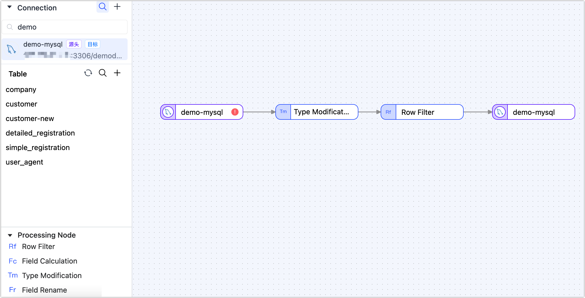
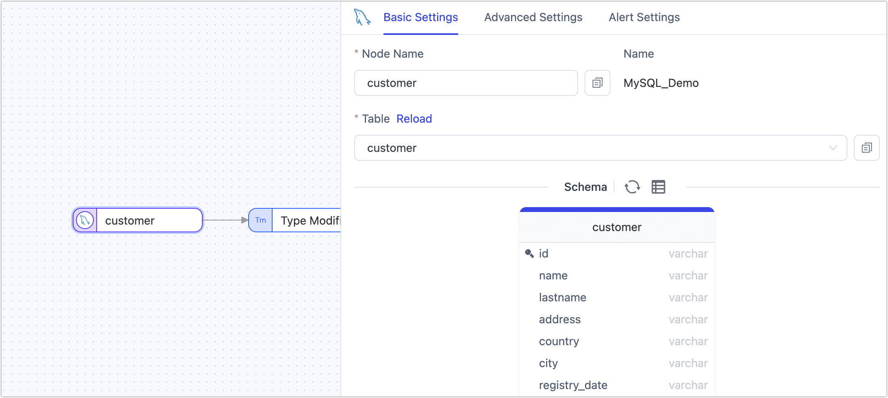
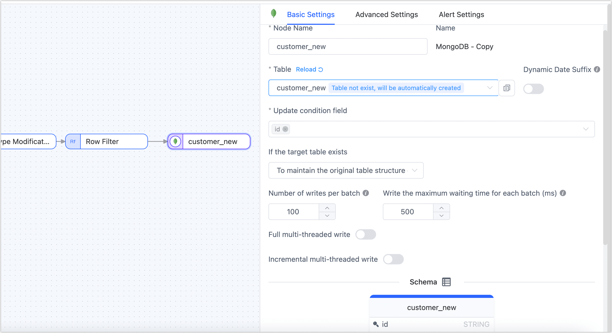

# Create a Data Transformation Task

import Content from '../../../reuse-content/_all-features.md';

<Content />

In Tapdata, data transformation tasks provide the capability to incorporate processing nodes between source and target data nodes. These processing nodes serve as valuable tools for efficiently carrying out data processing tasks, such as merging multiple tables, splitting data, and adding or removing fields. 

The following article outlines the step-by-step process of creating data transformation tasks, enabling users to leverage the advanced data processing functionalities offered by Tapdata.

## Procedure

As an example, we will show how to change the **birthdate** field's data type from **STRING** to **DATE** in the table structure without modifying the source table (**customer** table) and simultaneously filter out users born after **1991-01-01**, a data transformation task is created. The resulting table, **customer_new**, will reflect the updated table structure and filtered data.

1. [Log in to Tapdata Platform](../../log-in.md).

2. Based on the product type, select the operation entry:

   * **Tapdata Cloud**: In the left navigation panel, click **Data Transformation**.
   * **Tapdata Enterprise or Tapdata Community**: In the left navigation panel, choose **Data Pipelines** > **Transforms**.

3. Click **Create** on the right side of the page to go to the task configuration page.

4. In the **Connections** area on the left side of the page, drag and drop the source and target data into the right canvas located on the right side.

5. In the **Processing node** area on the left side of the page, drag and drop the **Type modification** node and the **Row Filter** node.

   :::tip

   For more information on processing nodes and application scenarios, see [processing nodes](process-node.md).

   :::

6. Connect the aforementioned four nodes in the order of data flow as shown below.

   

7. Follow the instructions below to configure each node in sequence.

   1. On the canvas, click the source node on the far left and complete the parameter configuration in the right panel according to the following instructions.
      

      * **Basic Settings**

        * **Node Name**: Defaults to the connection name, but you can set a name with business meaning.
        * **Table**: Select the source table to operate on. The table structure, including column names and column types, will be displayed below.

      * **Advanced Settings**

        * **DDL Sync Configuration**
          Choose whether to enable **DDL Event Collection**. Once this option is enabled, Tapdata will automatically collect the selected source DDL events (such as adding fields). If the target end supports DDL input, DDL statement synchronization can be achieved.

        * **Incremental Synchronization Method**
          Choose between **Log CDC** and **Polling**. If you select **Polling**, you need to specify the polling field, interval, and number of rows to be read each time. 

          **Log CDC** will use the data source transaction logs for parsing and incrementally syncing events, while **Polling** incrementally syncs events by polling fields, typically unable to sync delete events.

        * **Data Filter**

          * **Fully Customizable Query**: Once this option is enabled, you can enter the SQL query statement to be executed during the full data synchronization stage (does not affect the incremental stage). This allows for custom data extraction (such as data filtering, Joins, etc.), for example, entering `SELECT id, name, address FROM customer;`.
            :::tip
            Enabling this feature requires the target node to be a weak Scheme type data source (such as MongoDB/Kafka), etc.
            :::
          * **Filter Settings**: By default, it is off. When enabled, you need to specify the data filtering conditions.

        * **Batch Read Count**: During full synchronization, the number of records read in each batch. The default is **100**.

      * **Alert Settings**
        By default, if the node's average processing time is equal to or greater than 5 seconds for a consecutive minute, system and email notifications are sent. You can also adjust the rules or turn off alerts according to business needs.

   2. Click on the **Type Modification** node, and then in the right panel, modify the type of the **birthdate** field to **Date**.
      

   3. Click on the Row Filter node and complete the parameter configuration in the right panel according to the following instructions.

      

      * **Action**: Choose **Retain Matching Data**.
      * **Conditional Expression**: Enter the data matching expression, in this case `record.birthdate >= '1990-01-01'`, supported symbols are:
        * Comparison: greater than (`>`), less than (`<`), greater than or equal to (`>=`), less than or equal to (`<=`), equal to (`==`)
        * Logical Judgments: and (`&&`), or (`||`), not (`!`)
        * Regular Expression: e.g., `/^.*$/.test( )`
        * Conditional Grouping: If you need to add multiple condition groups, first enclose each group in parentheses, and then add logical judgment symbols between each group. For example, to filter males over 50 or people over 30 with an income under 10,000: `(record.gender == 0 && record.age > 50) || (record.age >= 30 && record.salary <= 10000)`

   4. Click the final <span id="target-node-set">target data node</span> and complete the parameter configuration in the right panel according to the following instructions.

      

      * **Basic Settings**
        * **Node Name**: Defaults to the connection name, but you can set a name with business meaning.
        * **Table**: Select the table to write the processed data to. The table will be created automatically if it does not exist.
        * **Update Condition Field**: Select the field to be the basis for the update condition.
        * **Existing Data Handling**: Choose according to business needs. If the target table has no data and its structure is inconsistent with the source table, you can choose **Clear the Existing Structure and Data of the Target Table**.
        * **Batch Write Count**: The number of entries written per batch during full synchronization.
        * **Maximum Wait Time per Batch Write**: Set the maximum waiting time based on the target database’s performance and network latency, measured in milliseconds.
        * **Full Multi-Threaded Write**: The number of concurrent threads for writing full data. The default is **8**; adjust based on the target end's write performance.
        * **Incremental Multi-Threaded  Write**: The number of concurrent threads for writing incremental data. By default, it is not enabled. Enable and adjust based on the target end's write performance.
        * **Schema**: Displays the source table structure information, including field names and field types.
      * **Advanced Settings**
        Choose the data writing mode according to business needs:
        * **Handle by Event Type**: After selecting this option, you need to also choose the data writing strategy for insert, update, and delete events.
        * **Statistic Append Write**: Only handles insert events, discarding update and delete events.
      * **Alert Settings**
        By default, if the node's average processing time is equal to or greater than 5 seconds for a consecutive minute, system and email notifications are sent. You can also adjust the rules or turn off alerts according to business needs.

8. (Optional) Click the  icon above to configure the task properties.

   * **Task name**: Fill in a name that has business significance.
   * **Sync type**: You have the option to select **full + incremental synchronization**, or you can choose to perform an **initial sync** and use Change Data Capture (**CDC**) separately. In real-time data synchronization scenarios, the combination of full and incremental data copying is often used to transfer existing data from the source database to the target database.
   * **Task description**: Provide the description information for the task based on your specific context and requirements.
   * **Advanced settings**: Set the start time of the task, select the incremental data processing mode, scheduled tasks, dynamic adjustment memory usage, specify the number of processor threads, and choose the appropriate agent.

9. Click **Save** or **Start**, the following figure shows that after the task starts successfully, you can view its QPS, delay, task event, and other information.

   

   :::tip

   After clicking on the **Save** or **Start** button, Tapdata will perform a pre-check of the configuration for each node to ensure the smooth operation of the task. If any configuration does not pass the pre-check, please make the necessary adjustments based on the log prompts provided on the current page.

   :::


## Data Validation

Log in to the target database to check the structure of the **customer_new** table. Verify that the **birthdate** column has a data type of **DateTime**. Next, check the number of users with birth dates earlier than **1990-01-01**. If the number is zero and the total number of records in the table is **31,276**, it confirms that the data has been successfully filtered according to the specified condition.

```sql
mysql> DESC customer_new;
+---------------+--------------+------+-----+---------+-------+
| Field         | Type         | Null | Key | Default | Extra |
+---------------+--------------+------+-----+---------+-------+
| id            | varchar(200) | NO   | PRI | NULL    |       |
| name          | varchar(200) | NO   |     | NULL    |       |
| lastname      | varchar(200) | NO   |     | NULL    |       |
| address       | varchar(200) | NO   |     | NULL    |       |
| country       | varchar(200) | NO   |     | NULL    |       |
| city          | varchar(200) | NO   |     | NULL    |       |
| registry_date | varchar(200) | NO   |     | NULL    |       |
| birthdate     | datetime(3)  | NO   |     | NULL    |       |
| email         | varchar(200) | NO   |     | NULL    |       |
| phone_number  | varchar(200) | NO   |     | NULL    |       |
| locale        | varchar(200) | NO   |     | NULL    |       |
+---------------+--------------+------+-----+---------+-------+
11 rows in set (0.00 sec)

mysql> SELECT COUNT(*) FROM customer_new WHERE birthdate < 1990-01-01;
+----------+
| count(*) |
+----------+
|        0 |
+----------+
1 row in set, 1 warning (0.01 sec)

mysql> SELECT COUNT(*) FROM customer_new
+----------+
| count(*) |
+----------+
|    31276 |
+----------+
1 row in set, 1 warning (0.01 sec)
```


## See also

By combining multiple processing nodes and multiple data sources, you can achieve a more complex and personalized data flow. For more information, see [processing nodes](process-node.md).

