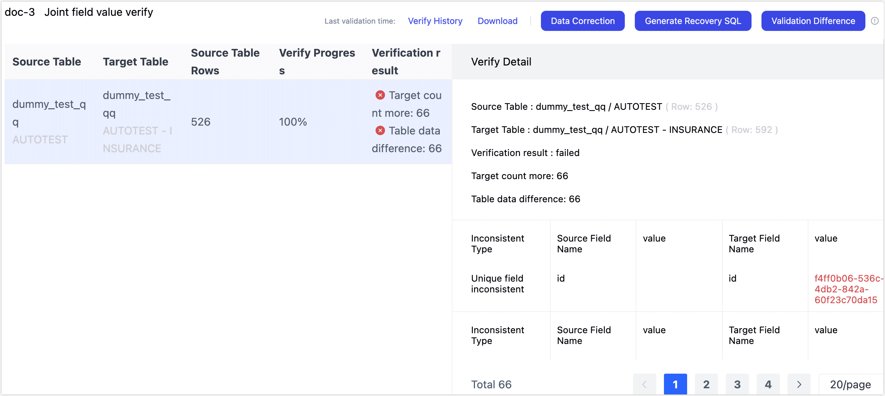

# Data Verification

Leveraging various proprietary technologies, Tapdata ensures maximum data consistency. In addition, Tapdata supports data table verification to further verify and ensure the correctness of data flow, meeting the stringent requirements of production environments. This document introduces the configuration process for data verification tasks.

```mdx-code-block
import Tabs from '@theme/Tabs';
import TabItem from '@theme/TabItem';
```

## Steps

1. Log in to the Tapdata platform.

2. In the left navigation bar, select **Data Pipeline** > **Data Verification**.

3. In the upper right corner of the page, click **Task Consistency Verification** or **Arbitrary Table Data Verification** based on your verification target, then fill in the parameters as described below:


```mdx-code-block
<Tabs className="unique-tabs">
<TabItem value="Task Consistency Verification">
```


- **Select Task**: Choose the data replication/data transformation task to verify.
- **Verification Task Name**: Enter a meaningful name for the task.
- **Verification Type**: Currently, the following three verification methods are supported. If the field names in the table have been modified during synchronization, executing **Full Table Field Value Verification** or **Associated Field Value Verification** may fail due to field name mismatches.
    - **Quick Count Verification**: Verifies the row count of the source and target tables without displaying specific difference content, very fast.
    - **Full Table Field Value Verification**: Verifies the values of all fields in the source and target tables row by row, displaying the difference content of all fields, slower.
    - **Associated Field Value Verification**: Only verifies the values of the associated fields in the source and target tables, medium speed.
- **Advanced Configuration**: Click on advanced configuration to unfold more configuration options:
    - **Result Output**: Choose **Output all inconsistent data** or **Only output inconsistent data from the source table**.
    - **Verification Task Alarm**: Choose the rule configuration and notification method for alarms when the task runs into errors or the verification results are inconsistent.
    - **Verification Frequency**: Default is **Single Verification**. If **Repeated Verification** is chosen, you also need to set the start and end time of the verification and the interval between tasks.
    - **Error Save Count**: The maximum number of inconsistent data records to save, default is 100, maximum is 10000. It's recommended to set a larger value to ensure completeness of records.
    - **Verification Table Configuration**: By default, Tapdata automatically loads the source/target data tables from the data replication/development tasks. Additionally, you can turn on the **Data Filter** switch to only verify specific condition data to reduce the verification scale (custom query and aggregate query filtering can be implemented via SQL). Moreover, you can add JS verification logic through advanced verification.

</TabItem>

<TabItem value="Arbitrary Table Data Verification">


- **Verification Task Name**: Enter a meaningful name for the task.
- **Verification Type**: Currently, the following three verification methods are supported.
    - **Quick Count Verification**: Verifies the row count of the source and target tables without displaying specific difference content, very fast.
    - **Full Table Field Value Verification**: Verifies the values of all fields in the source and target tables row by row, displaying the difference content of all fields, slower.
    - **Associated Field Value Verification**: Only verifies the values of the associated fields in the source and target tables, medium speed.
- **Advanced Configuration**: Click on advanced configuration to unfold more configuration options:
    - **Result Output**: Choose **Output all inconsistent data** or **Only output inconsistent data from the source table**.
    - **Verification Task Alarm**: Choose the rule configuration and notification method for alarms when the task runs into errors or the verification results are inconsistent.
- **Verification Frequency**: Default is **Single Verification**. If **Repeated Verification** is chosen, you also need to set the start and end time of the verification and the interval between tasks.
- **Error Save Count**: The maximum number of inconsistent data records to save, default is 100, maximum is 10000. It's recommended to set a larger value to ensure completeness of records.
- **Verification Table Configuration**: Click **Add Table** to manually specify the verification source/target data connections, tables to be verified, index fields, and verification model. Additionally, you can turn on the **Data Filter** switch to only verify specific condition data to reduce the verification scale (custom query and aggregate query filtering can be implemented via SQL). Moreover, you can add JS verification logic through advanced verification.
  If you need to verify multiple tables, click **Add Table** to continue adding verification conditions.

</TabItem>
</Tabs>


4. Click **Save**. After returning to the task list, click **Execute** for the target verification task.

5. (Optional) Click **Details** for the verification task to view detailed verification results.

   

   :::tip

   When the verification type is **Full Table Field Value Verification** or **Associated Field Value Verification**, you can also click **Difference Verification** in the upper right corner to re-verify the difference data results of this full verification to confirm whether the data has become consistent.

   :::


## Common Issues

For troubleshooting methods regarding failed verification tasks or inconsistent verification data, see [Common Questions on Data Verification](../../faq/data-pipeline#check-data).