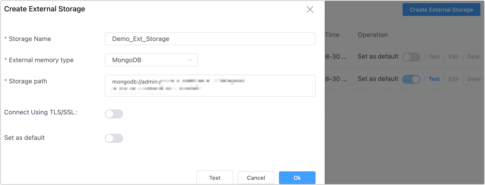

# Manage External Storage

To facilitate quick access to task-related information in the future, Tapdata stores essential configuration and shared cache information in an internal MongoDB database. For storing additional data (e.g., cache data), you can create an external database for this purpose.

## Prerequisite

An external database has been created for data storage, currently supporting MongoDB and RocksDB.

## Create External Storage

1. Log in to the Tapdata platform.

2. In the left navigation bar, select **System Management** > **External Storage Management**.

3. On the right side of the page, click **Create External Storage**.

4. In the popup dialog, complete the configuration based on the instructions below.

   

    - **External Storage Name**: Enter a meaningful name for the storage to facilitate future identification.
    - **External Storage Type**: Supports **MongoDB** and **RocksDB**.
    - **Storage Path**: Fill in the database connection address, for example, MongoDB format reference:

      `mongodb:/admin:password@127.0.0.1:27017/mydb?replicaSet=xxx&authSource=admin`.

    - **Use TLS/SSL Connection**: Choose whether to enable TSL/SSL encryption. If this feature is enabled, you will also need to upload the client private key.
    - **Set as Default**: Choose whether to set this as the default external storage.

5. Click **Test Connection**. After passing the test, click **Save**.

   :::tip

   If the connection test fails, follow the on-screen instructions to make corrections.

   :::

## Use External Storage

You can use the newly configured external storage in shared caches, and some processing nodes (e.g., Join Node) as shown below:

- When [creating a shared cache](../advanced-settings/share-cache.md), you can select external storage.

  

- When creating data replication/development tasks, adding [processing nodes](../data-pipeline/data-development/process-node.md) (such as Join Node), you can select external storage.

  