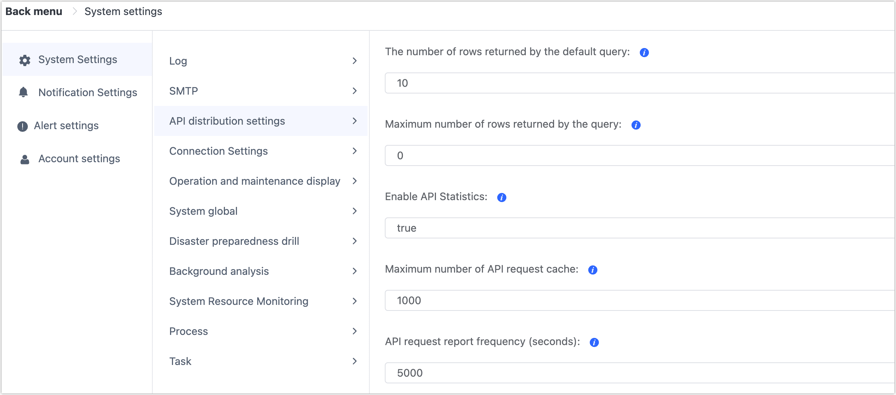
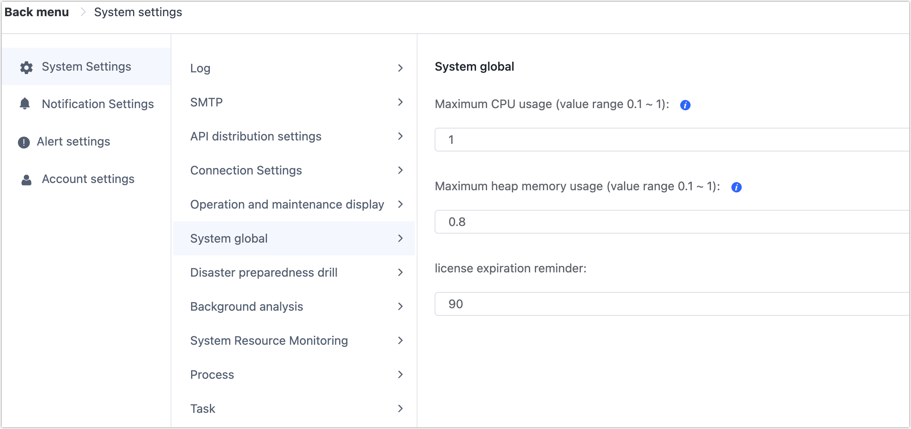

# System Settings
import Content from '../../reuse-content/_enterprise-features.md';

<Content />

The system settings feature is mainly used to configure some parameters of the system, such as logging, SMTP, API distribution, and more.

## Accessing System Settings

In the upper-right corner of the page, click on the  icon, and then click on **System Settings**.

## Log Settings

**Log Level**: In the log settings, you can set the log level. Available log levels include: **error**/**warn**/**info**/**debug**/**trace**. When you select a level, only logs of that level and higher will be printed in the logs.

**Log Filtering Interval (seconds)**: Set the time interval during which the same log will only appear once (effective after 1 minute).

**Log Output Frequency (lines/second)**: Set the average number of events allowed per second in the log settings.

## SMTP Settings

Configure SMTP service settings, including:

- **SMTP Service Account**: Set the SMTP account.
- **SMTP Service Password**: Set the password for the SMTP account.
- **Encryption Method**: Choose the encryption method, supporting SSL and TLS.
- **SMTP Service Host**: Set the host address of the SMTP service.
- **SMTP Service Port**: Set the port number of the SMTP service.
- **Email Sending Address**: Set the email address from which emails will be sent.
- **Email Receiving Address**: Set the email address where emails will be received.
- **Send Email Title Prefix**  (optional): Set the prefix for email subjects.

After configuring the settings, you can view the email templates. You can test the configuration by conducting a connection test.

After a successful connection test, click the Save button to save the SMTP settings.

## API Distribution Settings

Configure API distribution policies, including:

- **The Number of Rows returned by the Default Query:** Set the default number of rows returned by API queries.
- **Maximum Number of  Rows Returned by the Query**: Set the maximum number of rows returned by API queries.
- **Enable API Statistics**: Set whether to enable API statistics.
- **Maximum Number of API Request Cache**: Set the maximum number of cached API requests.
- **API Request Report Frequency** (seconds): Set the frequency of API request reporting.

## Connection Settings

Configure some settings related to connection management, including:

- **MongoDB Load Model Sampling Records** (rows): Set the number of sampling records when loading MongoDB models.
- **Data Source Schema Update Time**: Set the specific time for automatic data source schema updates.
- **Data Source Schema Update Interva**l (days): Set the update period for data source schemas in days.
- **Allow the Creation of Duplicate Data Sources**: Set whether to allow the creation of duplicate data sources.

## Operation Display Settings

Operation display settings include:

- **O&M Operation Control URL**
- **Flow Engine Version**
- **Tapdata Agent Version**

## Global System Settings

Global system settings support the following options:

- **Maximum CPU Usage** (range 0.1 to 1)
- **Maximum Heap Memory Usage** (range 0.1 to 1)
- **License Expiration Reminder**

## Disaster Drill Settings

Disaster drill settings mainly include:

- **Allow Disaster Recovery Exercises**
- **Mongod Path**
- **SSH Username**
- **SSH Port**

## Background Analysis Settings

Background analysis settings mainly set the interval for data quality analysis. You can adjust these settings according to your needs.

## System Resource Monitoring Settings

System resource monitoring settings mainly set the data collection frequency for system resource monitoring. You can adjust these settings according to your needs.

## Process Settings

Process settings are primarily used to set the expiration time for process heartbeats.

- **Process Heartbeat Period Time** (seconds)

## Task Settings

Task settings are mainly used to configure some parameters during task runtime. Supported settings include:

- **Incremental Lag Decision Time** (seconds): Sets the time threshold for determining if a task is lagging.
- **Whether to Add the Creation Time to Target Data Set**: true or false
- **Cache a copy of the current overall data and merge it into the target data set**
- **Cache a copy of the overall data before modification and merge it into the target data set**
- **Whether to transfer task logs to the cloud**
- **Interval time for switching to batch insert mode in incremental mode** (unit: second)
- **Sampling rate**
- **Task load threshold** (percentage)
- **Task load statistics time** (minute)
- **Illegal characters replaced with**
- **Synchronization task heartbeat timeout** (milliseconds)
- **Incremental synchronization task sharing mode**
- **Incremental tasks are forced to use shared mode**
- **Automatically save incremental events**
- **Incremental event save time** (days)
- **Retry Interval** (Second)
- **Maximum Retry Time**(Minute)
