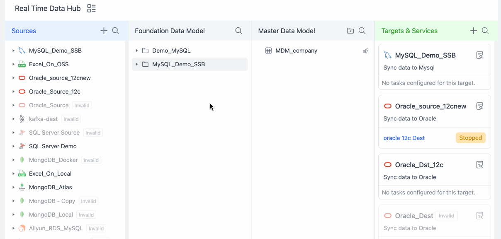
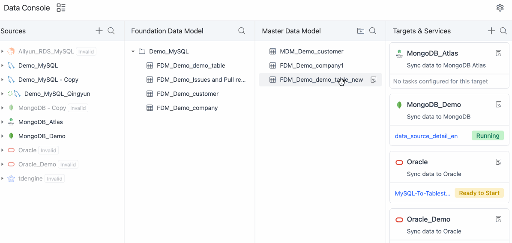

# Automatic Data Flow with One Click

In the Data Service Platform Mode, you can simply drag the source table to the required level to generate a data pipeline and automatically start the task, greatly simplifying the task configuration process. This article describes how to achieve the flow of data between different levels and finally provide it to the terminal business.

```mdx-code-block
import Tabs from '@theme/Tabs';
import TabItem from '@theme/TabItem';
```


## Procedure

1. Log in to Tapdata.

2. In the left navigation panel, click **Real-Time Data Hub**.

3. On this page, you can conveniently access the data source information you have entered. Tapdata organizes the data governance and flow order into four distinct levels, providing a clear view of the data hierarchy.

   

   :::tip

   For detailed descriptions of each layer, see [Real-Time Data Hub Introduction](enable-daas-mode.md).

   :::

4. Follow the process below to complete the data flow with one click.

   :::tip
   Through the **Master Data Model**, you can adjust the table structure (such as adding fields), merge tables, build wide tables, etc. If the table of the **Foundation Data Model** already meets your business needs, you can directly publish the API or drag the table of the cache layer to the **Target & Service**.
   :::

```mdx-code-block
<Tabs className="unique-tabs">
<TabItem value="Flow to Foundation Data Model">
```
1. At the <b>Sources</b>, click the </img> icon to find the table you want to synchronize and drag it to the **Foundation Data Model**.

2. In the pop-up dialog box,  fill in the table prefix that is meaningful for your business, select the synchronization type, and choose whether to run the task.

   In this case, the table we want to synchronize is the <b>customer</b>, fill in the prefix here is <b>FDM_demo</b>, then in the Master Data Model, the table is called <b>FDM__demo_customer</b>.

   

    * **Only Save**: Save the task without running it. You can now click on the task name in the Foundation Data Model to customize the task further.
    * **Save and Run**: No additional action is required. Tapdata Cloud will automatically create a data replication task to synchronize your selected tables in real-time to the Master Data Model and automatically verify. You can click the </img> icon on the right side of the table name in the Foundation Data Model and jump to the task monitoring page to see the task operation details.


</TabItem>

<TabItem value="Flow to Master Data Model">

1. At the **Foundation Data Model**, click the </img> icon to find the table you want to process and drag it to the **Master Data Model**.

2. In the pop-up dialog, fill in the table name and select whether to start the task.

   

    * <b>Only Save</b>: Save the task without running it. You can now click on the task name in the target data card to customize the task further. On the redirected task configuration page, you can <a href="../../data-pipeline/data-development/process-node">processing nodes</a> to meet requirements such as table structure adjustment (e.g., adding fields), table merging, and building wide tables. Once the setup is complete, click <b>Start</b> in the upper right corner of the page.
    * **Save and Run**: No further action is necessary as Tapdata Cloud automatically generates a data transformation task and initiates it to synchronize the table in real-time with the Data Processing Layer.

3. At the <b>Data Processing Layer</b>, find the target table and clicking on the icon as below show will allows you to explore the lineage of the table, revealing the chain of relationships that led to the creation of this data table. This feature assists you in effectively managing your tables.

   

   In this case, we constructed a wide table called **MDM_demo_customer** based on the initial **customer** and **lineorder** tables.

</TabItem>

<TabItem value="Flow to Target & Services">

1. From either the **Foundation Data Model** or the **Master Data Model** , locate the desired table that you wish to synchronize. Then, simply drag and drop the table onto the target data source within the **Targets & Service**.
   

2. In the pop-up dialog, enter the task name and choose whether to run the task.

    * <b>Only Save</b>: Save the task without running it. You can now click on the task name in the target data card to customize the task further. On the redirected task configuration page, you can add [processing nodes](../../data-pipeline/data-development/process-node.md) to meet requirements such as table structure adjustment (e.g., adding fields), table merging, and building wide tables. Once the setup is complete, click the <b>Start</b> in the upper right corner of the page.
    * <b>Save and Run</b>: No further action is necessary as Tapdata Cloud automatically generates a data transformation task and initiates it to synchronize the table in real-time with the Data Processing Layer.

   Once setup is complete, Tapdata will automatically create a data transformation task to synchronize your source tables in real-time to the selected target data source and provide them to the final business. You can also click the task name in the target data card to enter the task monitoring page to see the detailed operation status. For more information, see <a href="../../data-pipeline/data-development/monitor-task">Monitor Task</a>.

</TabItem>

</Tabs>
