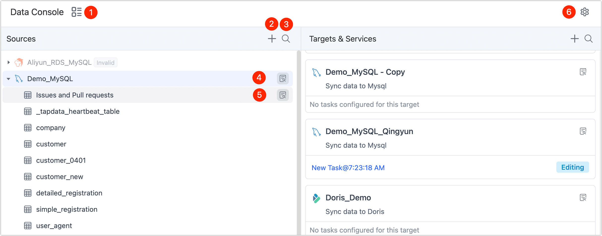

# Data Integration Dashboard

Tapdata Cloud's data console is designed with Data Integration Mode as its default setting. This mode is specifically designed for tasks such as data replication, synchronization, migrating data to the cloud, and building ETL pipelines. It offers a user-friendly interface where you can easily drag and drop the source table onto the target, allowing for the automatic creation of data replication tasks.

In this article, we will provide a comprehensive guide on utilizing the Data Integration Mode dashboard. It will walk you through the various functional modules, helping you gain a better understanding of how to effectively leverage this powerful tool.

:::tip

To minimize the impact on source databases and align with the data hierarchical governance concept, you can switch to the [Data Service Platform Model](../daas-mode/enable-daas-mode.md) in Tapdata Cloud. This model enables real-time data synchronization to the Data Cache Layer, ensuring up-to-date and consistent data across systems.

:::

## Procedure

1. Log in to Tapdata.

2. In the left navigation panel, click **Data Console**.

3. On this page, you can conveniently view the information you have entered for your data source. In the following sections, we will explain the functions of each button available.

   

import Tabs from '@theme/Tabs';
import TabItem from '@theme/TabItem';

<Tabs className="unique-tabs">
    <TabItem value="5" label="① Switch View Model" default>

   
Click the </img> icon to display the data source information in the form of a directory structure (click again to switch back to the Console view). Select the specific table, or view the tasks associated with the table and the basic information of the table, including table size, number of rows, column information, sample data, Scheme (such as primary key/foreign key), etc. 

   </img>
   

   </TabItem>
   <TabItem value="1" label="② Add Data Sources">
    
Clicking the </img> icon opens a dialog where you can add a data source. Selecting a data source will take you to the connection configuration page. For more information, see <a href="../../../prerequisites">Connect Data Sources</a>. 

   </TabItem>
   <TabItem value="2" label="③ Search Tables">

   
Clicking the </img> icon allows you to enter a keyword for the table name, enabling you to quickly navigate to the specific table. This feature is also supported in other Layers. 

   </img>
   </TabItem>
   <TabItem value="3" label="④ Data Source Detail">

   
On the right side of the data connection, click the </img> icon will display the connection information and associated tasks of the data source on the right side of the page. 

   </img>
   </TabItem>
   <TabItem value="4" label="⑤ Table Detail">

   
On the right side of the table name, click the </img> icon. On the right side of the page, the basic information of the tasks and tables associated with the table will be displayed, including table size, number of rows, column information, sample data, Scheme (such as primary key/foreign key), etc. 

   </img>
   </TabItem>
   <TabItem value="6" label="⑥ Switch Model">

   
Click the </img>icon to open the pop-up dialog, you can switch to the <a href="../daas-mode/enable-daas-mode">Data Service Platform Model</a>. 

</TabItem>
</Tabs>