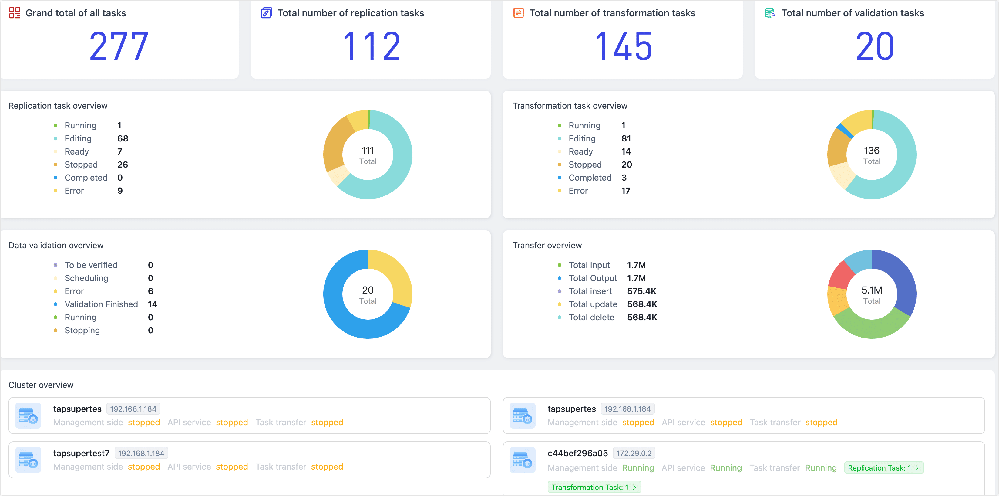
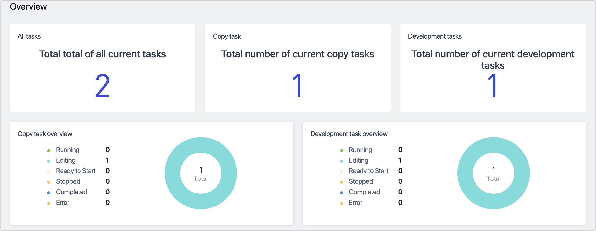

# Dashboard
import Content from '../reuse-content/_all-features.md';

<Content />

The dashboard provides a convenient platform to swiftly understand the product's functionality and effortlessly perform tasks like creating agents, establishing connections, and setting up tasks. Based on the product series you have chosen, refer to the following documentation.

## TapData Cloud

This helps you quickly understand and familiarize yourself with the product and allows you to quickly create Agents, connections, and tasks through the quick creation portal.

* **Product Tutorials**: Shows the best practices of TapData Cloud in different scenarios, such as data lake and warehousing.

* **Overview**: Displays the number and status information of Agents, connections, and tasks in TapData Cloud.

* **Announcements**: Displays the latest announcement information, including upgrade change reminders, and introductions to new features. Clicking on the title of an announcement allows you to view detailed content.

* **Notifications**: Hover over the **Notifications** in the upper right corner to quickly receive recent system notifications and alert information (such as Agent status notifications). Additionally, you can click on **Notification** to enter the **Notification Settings** page to set the rules for Agent notification methods (such as email/SMS) and **Default Alert Recipient** (supports multiple emails).

  

## TapData Enterprise

Displays statistics on the total number of all tasks, their status, and operational data in the current system, and allows you to view the operational status of the current system cluster.

The console page mainly includes the following key indicators:

- **All Tasks**: Displays the total number of all tasks for the current user, including data replication tasks, data transformation tasks, and data verification tasks.
- **Replication Tasks**: Displays the total number of data replication tasks created by the current user.
- **Transformation Tasks**: Displays the total number of data transformation subtasks created by the current user.
- **Verification Tasks**: Displays the total number of data verification tasks created by the current user.
- **Replication Task Overview**: Displays the task status distribution of all data replication tasks created by the current user.
- **Transformation Task Overview**: Displays the task status distribution of data transformation tasks created by the current user.
- **Data Verification**: Displays the verification result distribution of all data verification tasks created by the current user.
- **Transmission Overview**: Displays event transmission statistics for all data replication and data transformation tasks created by the current user.
- **Cluster Overview**: Displays the current status of each node service under the system cluster.

## TapData Community

Displays statistics on the total number of all tasks, their status, and operational data in the current system.

The console page mainly includes the following key indicators:

- **All Tasks**: Displays the total number of all tasks for the current user, including data replication tasks, data transformation tasks, and data verification tasks.
- **Replication Tasks**: Displays the total number of data replication tasks created by the current user.
- **Transformation Tasks**: Displays the total number of data transformation subtasks created by the current user.
- **Replication Task Overview**: Displays the task status distribution of all data replication tasks created by the current user.
- **Transformation Task Overview**: Displays the task status distribution of data transformation tasks created by the current user.
- **Transmission Overview**: Displays event transmission statistics for all data replication and data transformation tasks created by the current user.

## Related Documentation

Just 3 simple steps to experience the powerful and convenient data flow capabilities of TapData:

* [Install TapData](../quick-start/install/README.md)
* [Connect to a Database](../quick-start/connect-database.md)
* [Create a Data Pipeline](../quick-start/create-task.md)
