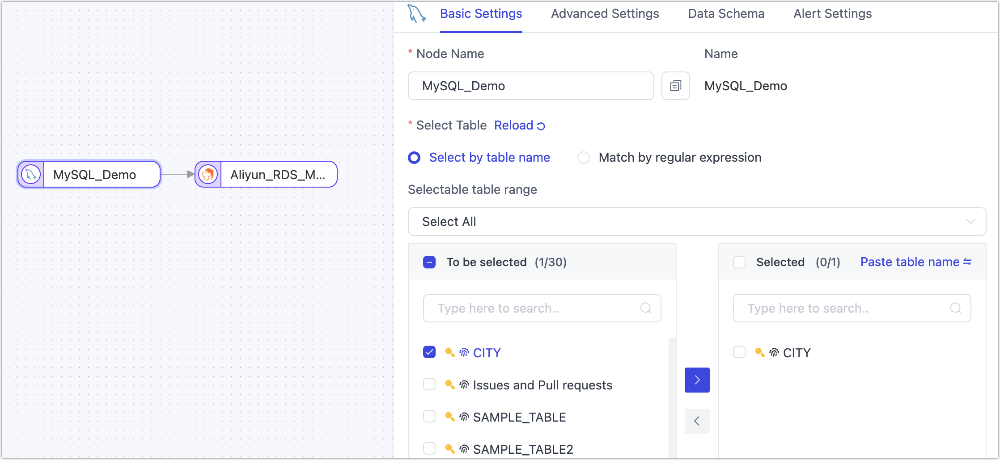
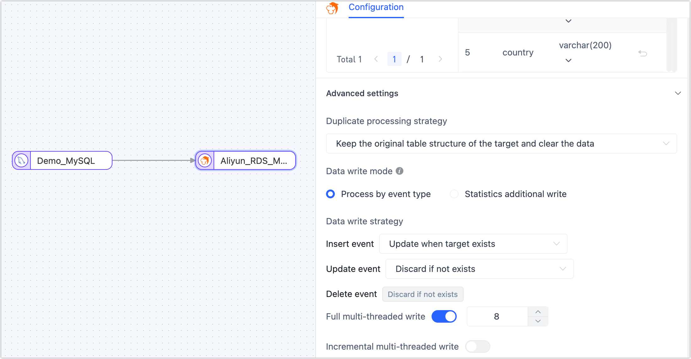

# MySQL to Alibaba Cloud Real-Time Sync
import Content from '../../reuse-content/_enterprise-and-cloud-features.md';

<Content />

As cloud computing evolves and becomes more prevalent, an increasing number of enterprises are looking to migrate their business from on-premises data centers to the cloud to leverage benefits such as lower operational costs and flexible scalability. For businesses with an on-premises MySQL database, migrating to the cloud is a critical step.

In this article, we will discuss how to migrate a MySQL database to the cloud using TapData, providing businesses with a straightforward and efficient data flow solution.

## Scenario Description

In this scenario, a company maintains a MySQL database in an on-prem data center to store its business application data. However, with the continuous expansion and development of the business, the company faces increasing operational costs, scalability challenges, and the need for better disaster recovery and fault tolerance.

To address these issues and leverage the benefits of cloud computing, the company has decided to use Alibaba Cloud RDS MySQL with [Serverless products](https://www.alibabacloud.com/help/en/rds/apsaradb-rds-for-mysql/rds-mysql-serverless), which offer real-time elasticity for CPU and memory usage, and pay-as-you-go pricing. This approach allows the company to quickly respond to business changes while optimizing costs. However, the company faces several challenges in implementing data migration to the cloud:

* How to migrate data quickly and easily.
* How to ensure the security and integrity of data transmission.
* How to ensure timely synchronization of data changes to facilitate rapid business switching.


To overcome these pain points, TapData provides a visual interface that simplifies task configuration through drag-and-drop operations. It also offers task status monitoring, displaying key metrics (such as latency of incremental data); end-to-end encryption for user/task information, ensuring data transmission security; and millisecond-level real-time data synchronization capabilities, helping enterprises smoothly transition to the cloud.

Next, we will introduce the specific operational procedures.

## Preparation

1. [Connect to your on-prem MySQL database](../../prerequisites/on-prem-databases/mysql.md).

   :::tip

   Follow the guide to configure Binlog settings for your on-prem MySQL and create an account for data migration.

   :::

2. [Connect to Alibaba Cloud RDS MySQL](../../prerequisites/cloud-databases/aliyun-rds-for-mysql.md).

## Steps

1. [Log in to the TapData platform](../../user-guide/log-in.md).

2. Based on the product type, select the operation entry:

   * **TapData Cloud**: In the left navigation panel, click **Data Replications**.
   * **TapData Enterprise**: In the left navigation panel, choose **Data Pipelines** > **Replications**.

3. Click **Create** on the right side of the page.

4. Drag the on-prem MySQL and Alibaba Cloud RDS MySQL data sources to the right canvas and connect them.

5. Click on the on-prem MySQL data source and complete the parameter configuration in the right panel as described below.

   

   - **Node Name**: Defaults to the connection name, but you can set a name with business significance.
   - **Select Tables**: Choose based on business needs.
      - **By Table Name**: Select tables in the area and click the right arrow to complete the setup.
      - **By Regular Expression**: Enter a regular expression for the table names. Additionally, when new tables in the source match the expression, they will also be synchronized to the destination.
   - **Batch Read Count**: Number of records read per batch during full synchronization, default is **100**.
   - **Advanced Settings**: Turn on **DDL Event Collection** switch, TapData will automatically capture selected DDL events from the source, like adding fields.

6. Click the Alibaba Cloud RDS MySQL data source and complete the configuration in the right panel as follows.

   1. Complete the node basic settings. 

      - **Node Name**: Defaults to the connection name, but you can set a name with business significance.
      - **Batch Write Count per Batch**: Number of entries written per batch during full synchronization.
      - **Max Wait Time per Batch Write**: Set the maximum wait time based on the performance and network latency of the destination, in milliseconds.
      - **Deduction Result**: Shows the table structure information that TapData will write to the destination, deduced based on the settings of the source node.

7. Scroll down to the **Advanced Settings** area and complete the advanced settings.

   

   - **Repeat Processing Strategy**: Choose based on business needs or keep default.
   - **Data Write Mode**: Choose based on business needs.
      - **Process by Event Type**: Choose the data writing strategy for insert, update, and delete events.
      - **Statistics additional Write**: Only handle insert events, discarding updates and deletions.
   - **Full Multi-thread Writing**: Number of concurrent threads for full data writing, default is **8**, adjust based on the write performance of the destination.
   - **Incremental Multi-thread Writing**: Number of concurrent threads for incremental data writing, not enabled by default, activate based on the write performance of the destination.

8. Once everything is confirmed correct, click **Start**.

   Once the operation is completed, you can observe the execution of the task on the current page, such as RPS (Records Per Second), delay, task timing statistics, etc., as shown below:

   

   As shown above, we deleted 2 entries in the source database, and this change was synchronized to the destination database in real-time. At this point, log into the destination database and check the number of entries, which should be 49,998.

   ```sql
   -- Log in to the Alibaba Cloud RDS MySQL database
   mysql -h rm-bp*******.rwlb.rds.aliyuncs.com -uroot -p
   
   -- Enter the database and check the count of entries in the customer table
   USE aliyun_demodata;
   SELECT COUNT(*) FROM customer;
   
   -- The result shows 49,998 entries, indicating that the data change was synchronized in real-time
   +----------+
   | COUNT(*) |
   +----------+
   |    49998 |
   +----------+
   ```

   This concludes our setup of a real-time data synchronization link. You can now fully test the cloud database in a test environment, and later, during a maintenance window, temporarily stop read/write operations on the source database, pause the link, and officially switch business traffic to the cloud database.

## Task Management

In the task list page, you can also start/stop, monitor, edit, copy, reset, or delete tasks.

For detailed operations, see [Manage Tasks](../../user-guide/copy-data/manage-task.md).