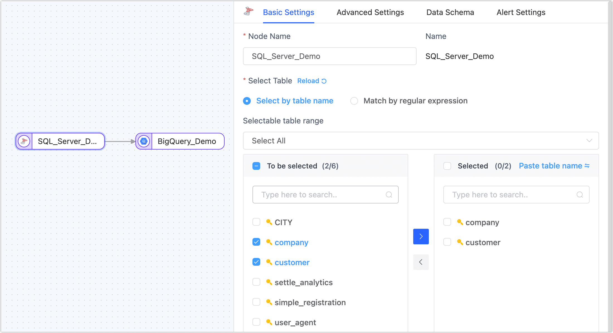
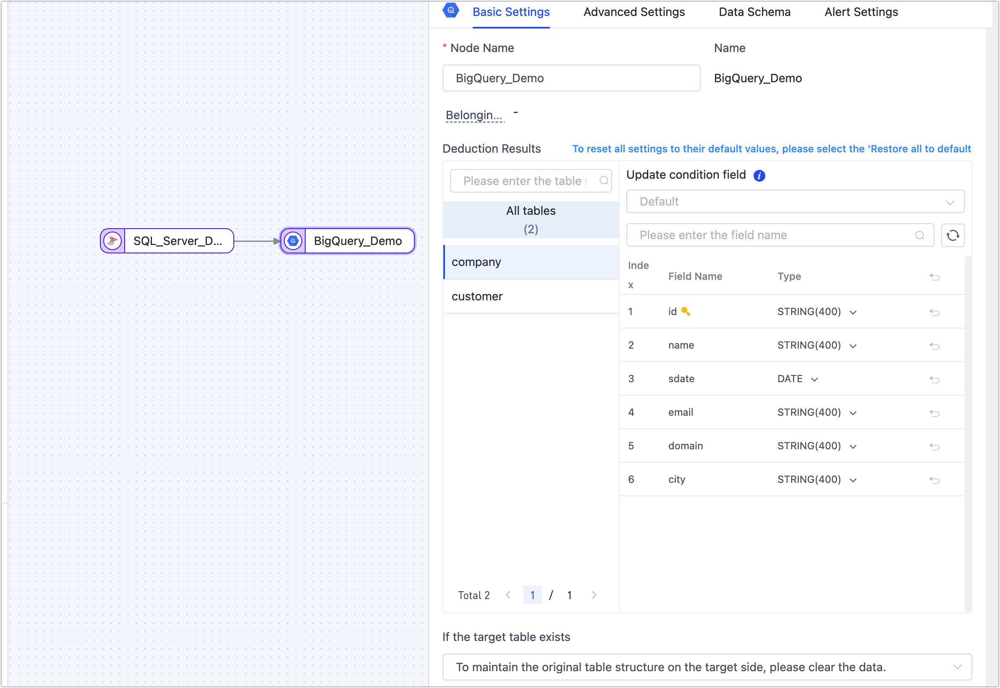

# SQL Server to BigQuery Real-Time Sync
import Content from '../../reuse-content/_all-features.md';

<Content />

In today's age of rapidly expanding data, companies are increasingly turning to [BigQuery](https://cloud.google.com/bigquery/docs)  in order to extract valuable insights and further modernize their data analysis strategies. Through BigQuery, they aim to run large-scale critical business applications, optimizing operations, enhancing customer experience, and reducing overall costs.

TapData Cloud, an integrated real-time data platform with ETL capabilities, has observed a growing trend and demand for migration from traditional internal data warehouses to BigQuery. Responding to this need, TapData launched a solution for BigQuery data synchronization, which significantly improves data write performance into BigQuery using temporary tables, thus reducing data synchronization latency. In this article, we'll use SQL Server as a case study to delve into how to seamlessly sync data in real-time to BigQuery, making the transition to a cloud-based data warehouse effortless.

# Background

BigQuery is a cloud-native enterprise-level data warehouse provided by Google Cloud. Leveraging Google's robust infrastructure, BigQuery allows for lightning-fast SQL queries on massive datasets and ensures safe, scalable analysis on petabyte-scale data. With its serverless architecture and cost-efficiency, BigQuery has garnered acclaim from numerous data analysts and engineers, offering unparalleled convenience in data storage and processing.

In the corporate environment, BigQuery is often the go-to for centralized storage of both historical and real-time data from various systems. Serving as the linchpin in a holistic data integration strategy, it also complements other existing databases. Some of its major benefits include:

- **Efficient Data Analysis**: BigQuery is tailor-made for swift, efficient analysis. By creating data replicas within its environment, intricate analyses can be executed without disrupting live operations.
  
- **Centralized Data Storage**: For analysts, querying across multiple platforms can be time-consuming. Consolidating data from various systems into a single warehouse can drastically streamline the process.
  
- **Security**: BigQuery allows users to fine-tune access to encrypted projects or datasets, safeguarding data integrity.
  
- **Scalability**: Depending on the size, performance, and cost requirements of a company, BigQuery offers flexible data storage scaling options.
  
- **Compatibility**: As part of the Google Cloud suite, BigQuery is highly compatible with other Google products, ensuring a user-friendly experience.

To fully tap into these advantages, the initial step is to ensure effective synchronization of data into BigQuery.

## Prerequisites

Before you create a replication task, make sure you have configured the relevant data source:

1. [Configure SQL Server Connection](../../prerequisites/on-prem-databases/sqlserver.md)
2. [Configure BigQuery Connection](../../prerequisites/warehouses-and-lake/big-query.md)

Also note the reference [data type support](../../user-guide/no-supported-data-type.md).

## Configure Task

1. [Log in to TapData Platform](../../user-guide/log-in.md).

2. Based on the product type, select the operation entry:

   * **TapData Cloud**: In the left navigation panel, click **Data Replications**.
   * **TapData Enterprise**: In the left navigation panel, choose **Data Pipelines** > **Replications**.

3. On the right side of the page, click **Create** to configure the task.

4. Drag the SQL Server and BigQuery data sources into right canvas from the left side of the page and connect them on the right canvas.

5. Click on the SQL Server source, and select the tables for syncing.

   Adjust advanced settings, view table structures, set batch sizes, and configure email alerts if needed. 

   

6. Click the BigQuery data source to preview the data structure and set advanced options.

   1. In the **Derivation Result** area, preview of the post-synchronization data structure. 

      

      :::tip

      To adjust the field type, click the  icon in the target field type, and in the dialog that pops up, complete the setup.

      :::

   2. Click the **Advanced Settings** tab, and complete the advanced setup.

      
      - **Data Write**: Choose the data writing mode:
         - **Process by Event Type**: When this option is selected, you'll also need to specify the write strategy for insert, update, and delete events.
         - **Append Write**: This mode only processes insert events, disregarding update and delete events.
      - **Data Source**: 
         - **Cursor Schema Name Prefix**: When an INSERT operation is performed on the source table, it will be directly synchronized to the target table. On the other hand, when an UPDATE or DELETE operation is performed on the source table, it will be synchronized to a temporary table within the target dataset. The temporary table will have a specified name prefix to distinguish it from the target table.
            :::tip
            For more information about temporary tables, see [FAQ](#faq).
         - **Data Merge Delay Time**: TapData will merge the data from the temporary table into the target table at regular time intervals. The specified time interval determines how frequently these merges occur. With shorter merge times, the target table will have more up-to-date data. It's important to note that the first merge occurs **1 hour** after the full data synchronization is completed.

   3. (Optional) Click on **Data Schema** tab to view the table structure, or click on **Alert Settings** tab to set the alert policies for the node.

7. After confirming the configuration is correct, click **Start**.

   After the operation is completed, you can observe the performance of the task on the current page, such as RPS (Records Per Second), delay, task time statistics, etc.

   

##  FAQ

* Q: How does the temporary table work?

   A: In order to improve the performance of data write and reduce data latency, TapData uses the Stream API and Merge API in combination based on BigQuery data characteristics. The process is as follows:

   1. During the full data synchronization stage, use the Stream API for data import.

   2. During the incremental data synchronization stage, incremental events are initially written to a temporary table in BigQuery. These events are stored in the temporary table until a periodic merge process is triggered. At the specified intervals, the data from the temporary table is merged into the target table, ensuring that the target table stays up to date with the latest incremental changes.

      :::tip

      The first merge occurs 1 hour after the completion of full synchronization data to ensure updates written by the Stream API are not missed.

      :::

* Q: What are the fields in the temporary table?

   A: The figure illustrates the structure and data of a data item within the temporary table. It includes the **merge_data_before** and **merge_data_after** fields, which store the data before and after the record change, respectively. The data type for these fields is [Record](https://cloud.google.com/bigquery/docs/nested-repeated). 

   In the case of the current record, identified by the **merge_type** as **D** (indicating a deletion), the merge_data_after field is empty, signifying that the data has been deleted.

   

* Q: Why is the data queried in BigQuery not up to date?

   A: You can view the incremental delay in the management interface of the task. Please note that apart from the network delay, the temporary table might not be immediately merged into the target BigQuery table. In such cases, it is recommended to wait for the automatic merge to take place before querying the target table.

