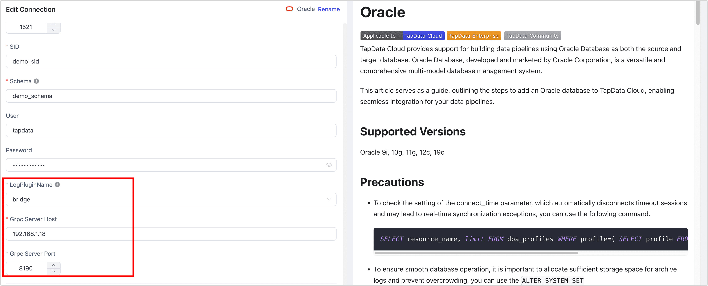
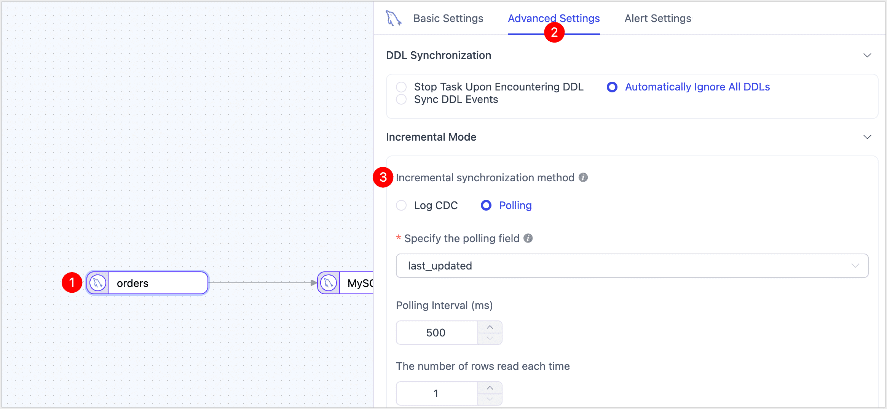

# Change Data Capture (CDC)
import Content from '../reuse-content/_all-features.md';

<Content />

Change Data Capture (CDC) is a method for capturing and tracking data changes in a database. It plays a crucial role in data synchronization and integration, enabling incremental data synchronization. This document provides a detailed overview of the various CDC methods, helping you understand their working principles, advantages, and disadvantages, and offering specific usage instructions.

```mdx-code-block
import Tabs from '@theme/Tabs';
import TabItem from '@theme/TabItem';
```

## CDC Methods


```mdx-code-block
<Tabs className="unique-tabs">
<TabItem value="Database Log API">
```
Database Log API-Based CDC is a commonly used data change capture technique that captures incremental data changes by reading and parsing the database's transaction logs. These logs are a key component used by the database management system to ensure data integrity and recoverability, recording every detailed operation of the database.

For example, in MySQL, administrators can enable Binlog by modifying the database configuration file (`mysql.cnf`) to record all data modification operations and capture data change details.

```sql
server_id         = 223344
log_bin           = mysql-bin
expire_logs_days  = 7
binlog_format     = row
binlog_row_image  = full
```

After completing [permission granting and data source connection](../prerequisites/on-prem-databases/mysql.md), you can configure it as a data source in Tapdata's task configuration to achieve full and incremental data synchronization (default).


</TabItem>

<TabItem value="Database Log File">
For Oracle and Db2 data sources, Tapdata provides raw log parsing capability in addition to the traditional LogMiner-based CDC. This approach directly parses the native binary log files, achieving more efficient event capture with higher collection performance (Records Per Second, RPS, over 20,000), and reduces the impact on the source database.

This solution requires the additional installation of a log parsing plugin. For example, with Oracle, after [contacting Tapdata technical support](../appendix/support.md) to complete the plugin deployment, you can choose the log plugin as **bridge** when [configuring the Oracle connection](../prerequisites/on-prem-databases/oracle.md). Then, fill in the IP address of the raw log service, with the default service port of **8190**.



</TabItem>

<TabItem value="Field Polling">
Field polling CDC detects data changes by periodically querying specified columns in the database table (such as timestamp or incrementing identifier columns). By comparing the data before and after, incremental changes can be determined.

For example, in MySQL, suppose there is a table `orders` where the `last_updated` field records the last update time of each record. Tapdata periodically polls the `last_updated` field to detect data changes, as shown in the following example SQL:

```sql
-- Query records that have changed since the last poll
SELECT * FROM orders WHERE last_updated > '2024-06-01 00:00:00';
```

After completing [permission granting and data source connection](../prerequisites/on-prem-databases/mysql.md), you can set the incremental synchronization method to **Polling** for the source node and select the target field (`last_updated`) in Tapdata when [configuring the data transformation task](../user-guide/data-development/create-task.md).



</TabItem>

<TabItem value="Database Trigger">
Trigger-based CDC captures data changes by creating triggers on database tables. A trigger is a special type of stored procedure that automatically executes predefined operations when specific database events (such as INSERT, UPDATE, or DELETE) occur, recording the changed data to another table or sending it to an external system.

For example, in MySQL, we first need to manually create a trigger to record changes in the `orders` table:

```sql
-- Create a table to record changes
CREATE TABLE orders_changes (
    id INT AUTO_INCREMENT PRIMARY KEY,
    order_id INT,
    change_type VARCHAR(10),
    change_time TIMESTAMP DEFAULT CURRENT_TIMESTAMP
);

-- Create triggers to track INSERT, UPDATE, and DELETE
CREATE TRIGGER after_orders_insert
AFTER INSERT ON orders
FOR EACH ROW
BEGIN
    INSERT INTO orders_changes (order_id, change_type) VALUES (NEW.id, 'INSERT');
END;

CREATE TRIGGER after_orders_update
AFTER UPDATE ON orders
FOR EACH ROW
BEGIN
    INSERT INTO orders_changes (order_id, change_type) VALUES (NEW.id, 'UPDATE');
END;

CREATE TRIGGER after_orders_delete
AFTER DELETE ON orders
FOR EACH ROW
BEGIN
    INSERT INTO orders_changes (order_id, change_type) VALUES (OLD.id, 'DELETE');
END;
```

After completing the setup, you can choose to develop your program to parse and process these changes, or use Debezium and Apache Kafka for more efficient incremental data processing.

:::tip

This method is not optimal and increases maintenance costs, so Tapdata does not adopt this approach.

:::

</TabItem>
</Tabs>

## CDC Method Comparison

```mdx-code-block
<Tabs className="unique-tabs">
<TabItem value="Feature Comparison">
```
| Category                               | Database Log API | Database Log File                       | Field Polling | Database Trigger                       |
| -------------------------------------- | ---------------- | --------------------------------------- | ------------- | -------------------------------------- |
| Distinguishes Insert/Update Operations | ✅                | ✅                                       | ➖             | ✅                                      |
| Monitors Delete Operations             | ✅                | ✅                                       | ➖             | ✅                                      |
| Real-time Collection                   | ✅                | ✅ (Ultra-high performance)              | ➖             | ✅                                      |
| Business Intrusion                     | 🟢 Low            | 🟢 Low                                   | 🔴 High        | 🟡 Medium                               |
| DBA Maintenance Cost                   | 🟡 Medium         | 🔴 High (Requires additional components) | 🟢 Low         | 🔴 High (Trigger management is complex) |
| System Overhead Cost                   | 🟢 Low            | 🟢 Low                                   | 🔴 High        | 🔴 High                                 |

</TabItem>

<TabItem value="Pros and Cons Comparison">

| CDC Method        | Advantages                                                                                                          | Disadvantages                                                |
| ----------------- |---------------------------------------------------------------------------------------------------------------------| ------------------------------------------------------------ |
| Database Log API  | ● Utilizes existing logs with minimal impact on performance<br />● Easily tracks schema changes                     | ● Requires sufficient storage space and expiration time for logs |
| Database Log File | ● Directly parses native binary logs, reducing intermediates<br/>● Higher collection performance, RPS over 20,000   | ● Requires additional component deployment and maintenance<br />● Requires broader account permissions |
| Field Polling     | ● Simple implementation, not dependent on logs or triggers<br />● Highly versatile, applicable to various databases | ● Lower real-time performance, dependent on polling frequency<br />● Business intrusion, involves table structure changes<br />● Cannot track deletions or schema changes |
| Database Trigger  | ● Operates at SQL level, simple implementation<br />● Reliable and detailed, accurately captures data changes       | ● Data changes require multiple writes<br />● Multiple triggers can severely impact performance<br />● Requires creating triggers on each table, high maintenance cost<br />● Triggers may be disabled under certain circumstances |

</TabItem>
</Tabs>

## FAQs

* Q: Which data sources does Tapdata support CDC capture for?

  A: Please refer to the tables in [Supported Data Sources](../prerequisites/supported-databases.md). If incremental data is supported as a data source, CDC information can be obtained.

* Q: If my data source supports CDC, how do I choose the CDC collection method?

  A: To maximize compatibility and collection performance, Tapdata supports the following CDC collection methods:
  * **Database Log API**: The default collection method, supported by most databases. If permission restrictions prevent log access or for certain SaaS data sources, choose the **Field Polling** method.
  * **Database Log File**: Currently supported only for Oracle and Db2 data sources.
  * **Field Polling**: Set the incremental synchronization method for the source node in Tapdata when [configuring the data transformation task](../user-guide/data-development/create-task.md).