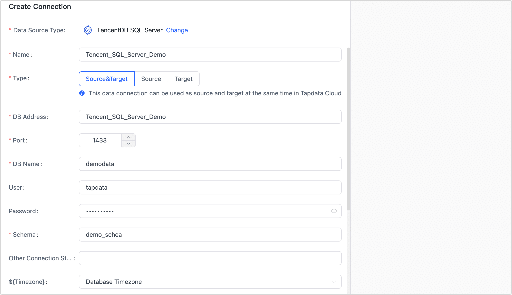

# TencentDB for SQL Server

import Content from '../../reuse-content/_enterprise-and-cloud-features.md';

<Content />

Tencent Cloud TencentDB for SQL Server is one of the most popular commercial databases in the industry, providing perfect compatibility with Windows-based applications. 

This article serves as a detailed guide, outlining the steps to seamlessly incorporate a TencentDB for SQL Server into TapData Cloud, enabling efficient data integration and management within your pipelines.

## Supported Versions

SQL Server 2005, 2008, 2008 R2, 2012, 2014, 2016, and 2017.

## Connect to TencentDB for SQL Server

1. [Log in to TapData Platform](../../user-guide/log-in.md).

2. In the left navigation panel, click **Connections**.

3. On the right side of the page, click **Create connection**.

4. In the pop-up dialog, select **TencentDB SQL Server**.

5. On the page that you are redirected to, follow the instructions below to fill in the connection information for SQL Server.

   

   * Connection Information Settings

      * **Connection name**: Fill in a unique name that has business significance.
      * **Connection type**: Supports SQL Server as a source or target database.
      * **DB address**: The database connection address.
      * **Port**: The service port of database.
      * **DB name**: Database name, a connection corresponding to a database, if there are multiple databases, you need to create multiple connections.
      * **User**: The database username.
      * **Password**: The database password.
      * **Schema**: Schema name.
      * **Other Connection Parameter String**: additional connection parameters, default empty.
   * Advanced settings

      * **Timezone**: Defaults to the time zone used by the database, which you can also manually specify according to your business needs.
      * **Contain table**: The default option is **All**, which includes all tables. Alternatively, you can select **Custom** and manually specify the desired tables by separating their names with commas (,).
      * **Exclude tables**: Once the switch is enabled, you have the option to specify tables to be excluded. You can do this by listing the table names separated by commas (,) in case there are multiple tables to be excluded.
      * **Agent settings**: Defaults to **Platform automatic allocation**, you can also manually specify an agent.
      * **Model load time**: If there are less than 10,000 models in the data source, their information will be updated every hour. But if the number of models exceeds 10,000, the refresh will take place daily at the time you have specified.

6. Click **Connection Test**, and when passed, click **Save**.

   :::tip

   If the connection test fails, follow the prompts on the page to fix it.

   :::
