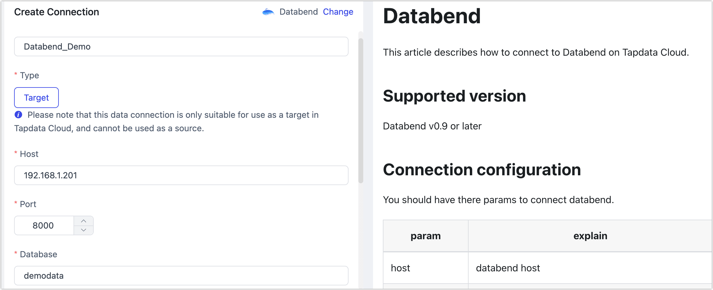

# Databend

import Content1 from '../../reuse-content/_enterprise-and-cloud-features.md';

<Content1 />

Databend is an open-source, elastic, and workload-aware modern cloud data warehouse. Utilizing the latest vectorized query processing technology, Databend helps users perform rapid data analysis on object storage.

This article guides you through connecting a self-hosted Databend on the TapData Cloud.

## Supported Versions

Databend v0.9 and above

import Content from '../../reuse-content/_beta.md';

<Content />

## Preparation

1. Log in to the Databend database and execute the following command to create an account for data synchronization/development tasks:

   ```sql
   CREATE USER 'username' IDENTIFIED BY 'password';
   ```

   - **username**: The username.
   - **password**: The password.

   Example: Create an account named tapdata.

   ```sql
   CREATE USER 'tapdata' IDENTIFIED BY 'Tap@123456';
   ```

2. Grant the newly created account all privileges on a specified database, so that TapData Cloud can automatically create the target tables for synchronization. You can also set more granular permissions based on business needs. For more, see [GRANT Syntax](https://docs.databend.com/sql/sql-commands/ddl/user/grant).

   ```sql
   -- Replace database_name and username as per the instructions below
   GRANT ALL ON database_name.* TO username;
   ```

   * **database_name**: The name of the database to grant permissions to.
   * **username**: The username.

## Connecting to Databend

1. [Log in to TapData Platform](../../user-guide/log-in.md).

2. In the left navigation panel, click **Connections**.

3. On the right side of the page, click **Create connection**.

4. In the pop-up dialog, search for and select **Databend**.

5. On the redirected page, fill in the connection information for Databend as per the instructions below.

   

    - **Basic Connection Settings**
      - **Name**: Enter a unique name with business significance.
      - **Type**:  ClickHouse databases can only be targets.
      - **Host**: The connection address of Databend.
      - **Port**: The service port of Databend, typically **8000**.
      - **Database**: Database name, a connection corresponding to a database, if there are multiple databases, you need to create multiple connections.
      - **Account**, **Password**: Fill in the database account and password respectively.
      - **Connection Parameters**: Additional [connection parameters](https://docs.databend.com/developer/drivers/jdbc#configuring-connection-string), default is empty.
    - **Advanced Settings**
      - **Agent settings**: Defaults to **Platform automatic allocation**, you can also manually specify an agent.
      - **Model load time**: If there are less than 10,000 models in the data source, their information will be updated every hour. But if the number of models exceeds 10,000, the refresh will take place daily at the time you have specified.

6. Click **Test** at the bottom of the page. After passing the test, click **Save**.

   :::tip

   If the connection test fails, follow the on-page prompts for troubleshooting.

   :::